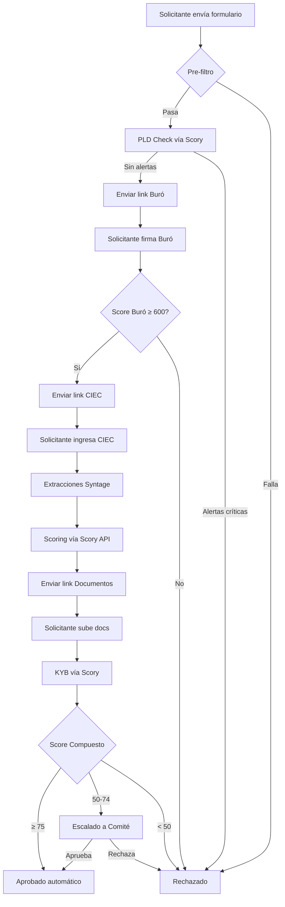
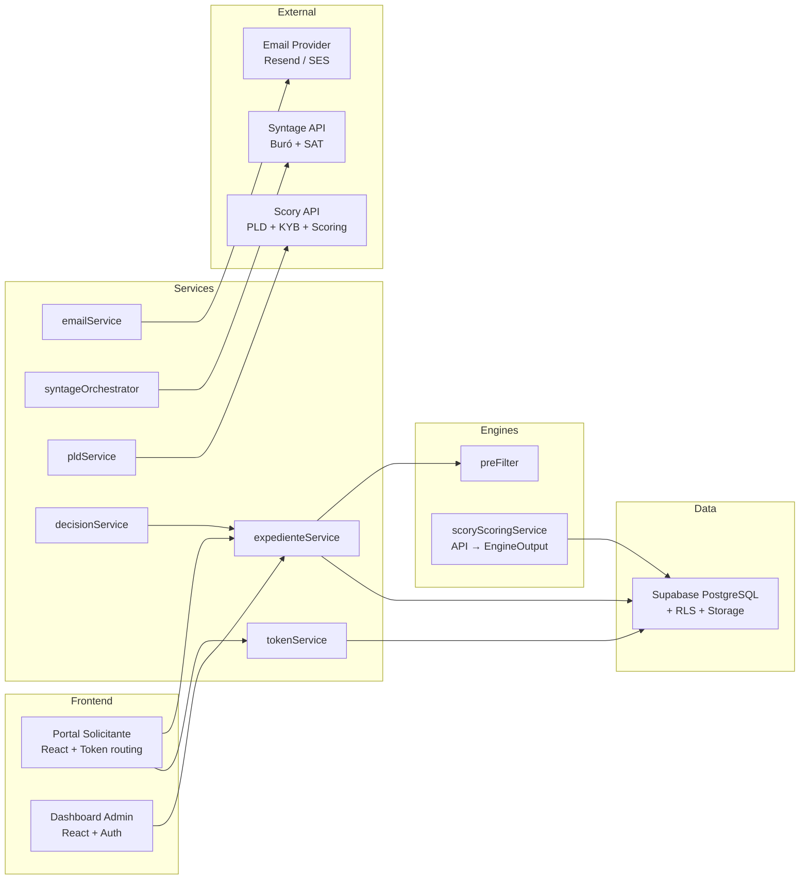
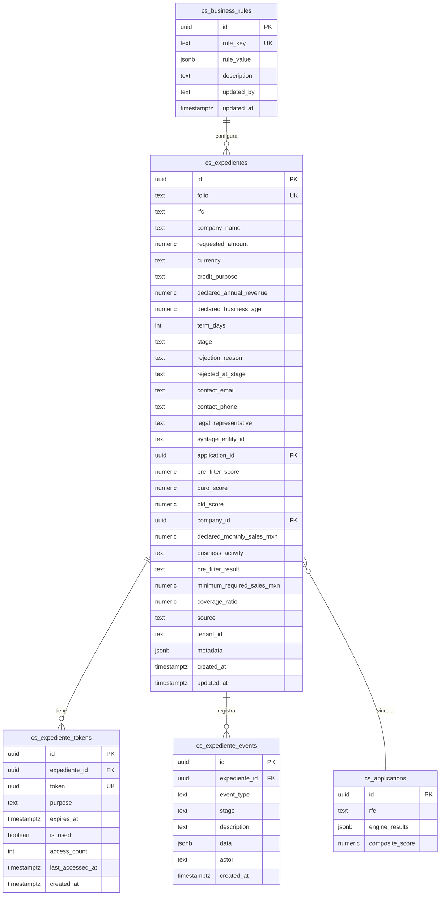

# Documento de Diseño — Expediente Digital (M02)

## Resumen

Este diseño describe la implementación completa del ciclo de vida de una solicitud de crédito digital para Xending Capital SOFOM ENR. El sistema orquesta un flujo de 7 etapas (pre_filter → pld_check → buro_authorization → sat_linkage → analysis → documentation → decision) con tokens de acceso sin login para el solicitante, audit log inmutable, notificaciones por email y un dashboard administrativo.

El diseño se apoya en la infraestructura existente: Supabase (PostgreSQL + RLS + Storage), clientes de API Syntage y Scory ya construidos, 16+ engines de scoring, y la migración 030 ya desplegada. Se requieren migraciones incrementales (031+) para campos faltantes y políticas RLS.

---

## Arquitectura

### Diagrama de flujo principal



### Capas del sistema



### Decisiones de arquitectura

1. **State machine centralizada**: Toda transición de etapa pasa por `expedienteStateMachine.ts` que valida la transición antes de ejecutarla. Esto garantiza integridad del flujo.
2. **Tokens sin login**: El solicitante nunca crea cuenta. Cada etapa que requiere su acción genera un UUID v4 con propósito y expiración. Esto reduce fricción y simplifica el flujo.
3. **Audit log append-only**: La tabla `cs_expediente_events` solo permite INSERT. Cada transición, acción de API y acción del usuario genera un evento inmutable.
4. **Reglas de negocio en BD**: Todos los umbrales (montos, scores, plazos) se leen de `cs_business_rules` en runtime, permitiendo ajustes sin redespliegue.
5. **Scoring delegado a Scory API**: En lugar de ejecutar 16+ engines localmente, el sistema envía los datos del expediente a la API de Scory.ai (`POST /v1/scoring/analyze`) que retorna todos los scores individuales y el score compuesto. Los resultados se mapean al tipo `EngineOutput` existente para mantener compatibilidad con la UI.
6. **Supabase como backend**: Se usa PostgreSQL con RLS para multi-tenant, Storage para documentos, y tipos TypeScript generados desde el esquema.

---

## Componentes e Interfaces

### 1. State Machine (`expedienteStateMachine.ts`) — Ya existe

Componente puro (sin side effects) que define transiciones válidas, eventos por transición, labels de UI y progreso.

**Interfaz existente:**
```typescript
function isValidTransition(from: ExpedienteStage, to: ExpedienteStage): boolean
function getNextStages(current: ExpedienteStage): ExpedienteStage[]
function isFinalStage(stage: ExpedienteStage): boolean
function getTransitionEvent(from: ExpedienteStage, to: ExpedienteStage): ExpedienteEventType
function getProgress(stage: ExpedienteStage): number
```

**Cambios requeridos:** Ninguno. La state machine actual cubre todas las transiciones del requerimiento 11.

### 2. Servicio de Expedientes (`expedienteService.ts`) — Ya existe, requiere migración a Supabase

Actualmente usa store en memoria. Se debe migrar a llamadas Supabase reales.

**Interfaz existente (se mantiene):**
```typescript
function createExpediente(input: PreFilterInput): CreateExpedienteResult
function advanceExpediente(id: string, toStage: ExpedienteStage, actor?: string, data?: Record<string, unknown>): TransitionResult
function rejectExpediente(id: string, reason: string, actor?: string): TransitionResult
function getExpediente(id: string): Expediente | undefined
function listExpedientes(filters?: ExpedienteFilters): Expediente[]
function getExpedienteEvents(expedienteId: string): ExpedienteEvent[]
function countByStage(): Record<ExpedienteStage, number>
```

**Cambios requeridos:**
- Reemplazar `Map` en memoria por queries a Supabase (`cs_expedientes`, `cs_expediente_events`)
- Agregar verificación de duplicados (RFC + monto + fecha) para idempotencia (Req 14.4)
- Hacer transiciones atómicas dentro de transacciones SQL (Req 11.5)
- Agregar función `addExpedienteNote` con actor "analyst" (Req 13.6)

### 3. Servicio de Tokens (`tokenService.ts`) — Ya existe, requiere migración a Supabase

**Interfaz existente (se mantiene):**
```typescript
function createToken(expedienteId: string, purpose: TokenPurpose, expiryHours?: number): ExpedienteToken
function validateToken(tokenValue: string): TokenValidationResult
function markTokenUsed(tokenValue: string): boolean
function invalidateAllTokens(expedienteId: string): number
function getTokensNearExpiry(hoursBeforeExpiry?: number): ExpedienteToken[]
```

**Cambios requeridos:**
- Migrar a Supabase (`cs_expediente_tokens`)
- Validación server-side de expiración (Req 15.2)
- Detección de abuso: invalidar token si `access_count > 50` (Req 15.5)
- Leer `token_expiry_hours` desde `cs_business_rules` (Req 8.2)

### 4. Servicio PLD (`pldService.ts`) — Nuevo

Orquesta la verificación PLD/KYC usando el `scoryClient` existente.

```typescript
interface PldCheckResult {
  passed: boolean;
  score: number;
  alerts: Array<{ type: string; severity: string; detail: string }>;
  hasCriticalAlerts: boolean;
}

async function runPldCheck(expedienteId: string): Promise<PldCheckResult>
```

**Comportamiento:**
- Llama a `validateCompliance(rfc)` del `scoryClient` existente
- Mapea `ComplianceResult` a `PldCheckResult`
- Retry con backoff exponencial ya implementado en `scoryClient` (3 intentos, 30s timeout)
- Si falla después de reintentos → notifica analista para revisión manual (Req 2.5)
- Si alertas críticas → rechaza expediente e invalida tokens (Req 2.3)

### 5. Servicio de Scoring vía Scory (`scoryScoringService.ts`) — Nuevo

Reemplaza la ejecución local de 16+ engines. Envía datos del expediente a Scory.ai y mapea la respuesta al tipo `EngineOutput` existente.

```typescript
interface ScoryScoringRequest {
  rfc: string;
  syntage_entity_id: string;
  buro_score: number;
}

interface ScoryScoringResponse {
  composite_score: number;
  engines: Record<string, ScoryEngineResult>;
  ai_narrative: string;
  decision_recommendation: 'approved' | 'conditional' | 'committee' | 'rejected';
}

interface ScoryEngineResult {
  score: number;
  grade: string;
  status: 'pass' | 'fail' | 'warning' | 'error';
  risk_flags: Array<{ code: string; severity: string; message: string }>;
  metrics: Record<string, unknown>;
  explanation: string;
}

async function runScoryAnalysis(request: ScoryScoringRequest): Promise<{
  compositeScore: number;
  engineOutputs: EngineOutput[];
  aiNarrative: string;
}>
```

**Comportamiento:**
- Llama a `POST /v1/scoring/analyze` con Bearer token (`VITE_SCORY_API_KEY`)
- Timeout de 60 segundos (scoring es más pesado que compliance)
- Retry 3x con backoff exponencial (2s, 4s, 8s)
- Cachea resultado 1 hora en `cs_api_cache` (provider: "scory", endpoint: "scoring/analyze")
- Logea cada llamada en `cs_api_calls`
- Mapea cada `ScoryEngineResult` al tipo `EngineOutput` existente para compatibilidad con UI
- Si la API falla después de 3 reintentos → registra error, notifica analista

### 6. Servicio de Decisión (`decisionService.ts`) — Nuevo

Implementa la lógica de decisión automática basada en score compuesto.

```typescript
type DecisionOutcome = 'auto_approved' | 'committee' | 'auto_rejected';

interface DecisionResult {
  outcome: DecisionOutcome;
  compositeScore: number;
  thresholds: { approval: number; rejection: number };
  reason: string;
}

async function makeDecision(expedienteId: string): Promise<DecisionResult>
```

**Comportamiento:**
- Lee umbrales de `cs_business_rules` (default: ≥75 aprobación, <50 rechazo)
- Score ≥ 75 → `auto_approved`, avanza a `approved`
- Score 50-74 → `committee`, registra evento `decision_sent_to_committee`
- Score < 50 → `auto_rejected`, avanza a `rejected`
- Envía email correspondiente al solicitante

### 6. Servicio de Email (`emailService.ts`) — Ya existe

Templates HTML con branding Xending ya implementados. Falta integrar proveedor real.

**Cambios requeridos:**
- Integrar Resend o Amazon SES en `sendEmail()` (actualmente es placeholder)
- Agregar job de recordatorio: tokens activos no usados a 48h de expirar (Req 10.3)

### 7. Orquestador Syntage (`syntageOrchestrator.ts`) — Ya existe

Coordina el flujo completo de Syntage (entidad → credencial CIEC → extracciones → polling).

**Cambios requeridos:** Mínimos. El orquestador actual ya cubre el flujo de Req 4. Solo ajustar para registrar eventos más granulares en el audit log.

### 8. Portal del Solicitante — Nuevo (React)

Páginas públicas accesibles vía token:

| Ruta | Propósito | Token requerido |
|------|-----------|-----------------|
| `/solicitud/nuevo` | Formulario pre-filtro | Ninguno (público) |
| `/solicitud/:token` | Router por propósito | Cualquiera válido |

**Componentes:**
- `PreFilterForm` — Formulario público de solicitud inicial
- `BuroSignatureView` — Firma de autorización Buró
- `CiecLinkageView` — Ingreso de CIEC + progreso de extracciones
- `DocumentUploadView` — Carga de documentos con drag-and-drop + checklist
- `ExpedienteTrackingView` — Vista de seguimiento con timeline y progreso
- `TokenErrorView` — Mensajes de token expirado/usado/inválido

### 9. Dashboard Administrativo — Extensión del existente

Se extiende el dashboard existente (`ApplicationsPage`, `ApplicationDetailPage`) con:

- `ExpedienteListPage` — Lista con paginación, filtros por etapa/fecha/folio/RFC, pipeline visual
- `ExpedienteDetailPage` — Detalle con timeline de audit log, acciones manuales
- `ExpedientePipelineView` — Contadores por etapa como Kanban visual
- Acciones: rechazar (con motivo), agregar nota, reenviar token

### 10. Migración incremental (031+)

Agrega campos faltantes a `cs_expedientes`:

```sql
ALTER TABLE cs_expedientes ADD COLUMN company_id UUID REFERENCES cs_companies(id);
ALTER TABLE cs_expedientes ADD COLUMN declared_monthly_sales_mxn NUMERIC(15,2);
ALTER TABLE cs_expedientes ADD COLUMN business_activity TEXT;
ALTER TABLE cs_expedientes ADD COLUMN pre_filter_result TEXT CHECK (pre_filter_result IN ('approved','review','rejected'));
ALTER TABLE cs_expedientes ADD COLUMN minimum_required_sales_mxn NUMERIC(15,2);
ALTER TABLE cs_expedientes ADD COLUMN coverage_ratio NUMERIC(5,4);
ALTER TABLE cs_expedientes ADD COLUMN source TEXT DEFAULT 'digital_onboarding';
ALTER TABLE cs_expedientes ADD COLUMN tenant_id TEXT DEFAULT 'xending';
```

Agrega RLS policies y constraint de unicidad para idempotencia.

---

## Modelos de Datos

### Diagrama ER



### Tipos TypeScript principales (ya definidos en `expediente.types.ts`)

| Tipo | Descripción |
|------|-------------|
| `ExpedienteStage` | Union de 10 etapas posibles |
| `CreditPurpose` | 4 propósitos válidos |
| `Expediente` | Entidad principal con todos los campos |
| `ExpedienteToken` | Token de acceso con propósito y expiración |
| `ExpedienteEvent` | Evento inmutable del audit log |
| `ExpedienteEventType` | Union de 27 tipos de evento |
| `PreFilterInput` | Datos del formulario inicial |
| `PreFilterResult` | Resultado del pre-filtro con reglas evaluadas |
| `BusinessRules` | Configuración de umbrales |
| `TokenPurpose` | 4 propósitos de token |

### Campos nuevos (migración 031)

| Campo | Tipo | Descripción |
|-------|------|-------------|
| `company_id` | UUID FK | Referencia a empresa en cs_companies |
| `declared_monthly_sales_mxn` | NUMERIC(15,2) | Ventas mensuales declaradas en MXN |
| `business_activity` | TEXT | Giro del negocio |
| `pre_filter_result` | TEXT | Resultado: approved/review/rejected |
| `minimum_required_sales_mxn` | NUMERIC(15,2) | Ventas mínimas requeridas calculadas |
| `coverage_ratio` | NUMERIC(5,4) | Ratio de cobertura ventas/monto |
| `source` | TEXT | Origen: digital_onboarding/internal/referral |
| `tenant_id` | TEXT | Identificador de tenant para multi-tenant |

### RLS Policies (migración 031)

```sql
-- Analistas autenticados ven expedientes de su tenant
CREATE POLICY expedientes_tenant_read ON cs_expedientes
  FOR SELECT USING (tenant_id = current_setting('app.tenant_id', true));

-- Sistema puede insertar/actualizar
CREATE POLICY expedientes_system_write ON cs_expedientes
  FOR ALL USING (auth.role() = 'service_role');

-- Eventos: solo INSERT permitido para todos, SELECT por tenant
CREATE POLICY events_insert ON cs_expediente_events
  FOR INSERT WITH CHECK (true);
CREATE POLICY events_read ON cs_expediente_events
  FOR SELECT USING (
    expediente_id IN (SELECT id FROM cs_expedientes WHERE tenant_id = current_setting('app.tenant_id', true))
  );

-- Tokens: acceso público por token UUID (para solicitantes)
CREATE POLICY tokens_public_read ON cs_expediente_tokens
  FOR SELECT USING (true);
```

### Constraint de idempotencia

```sql
CREATE UNIQUE INDEX idx_expediente_dedup
  ON cs_expedientes(rfc, requested_amount, date_trunc('day', created_at))
  WHERE stage != 'rejected' AND stage != 'expired';
```


---

## Propiedades de Correctitud

*Una propiedad es una característica o comportamiento que debe mantenerse verdadero en todas las ejecuciones válidas de un sistema — esencialmente, una declaración formal sobre lo que el sistema debe hacer. Las propiedades sirven como puente entre especificaciones legibles por humanos y garantías de correctitud verificables por máquina.*

### Property 1: Pre-filter score is bounded 0-100

*For any* `PreFilterInput` and any `BusinessRules` configuration, `runPreFilter(input, rules)` shall return a `PreFilterResult` where `score` is an integer between 0 and 100 inclusive, and `rules` is a non-empty array.

**Validates: Requirements 1.1**

### Property 2: Pre-filter rejects on any single rule violation

*For any* `PreFilterInput` that violates at least one business rule (amount out of range, revenue below multiplier, age below minimum, invalid purpose, or term out of range), `runPreFilter(input, rules).passed` shall be `false` and `rejection_reason` shall be non-null.

**Validates: Requirements 1.2, 1.3, 1.4, 1.5, 1.6, 1.8**

### Property 3: Pre-filter pass creates expediente at pld_check stage

*For any* valid `PreFilterInput` where all business rules pass, `createExpediente(input)` shall return a result where `expediente.stage === 'pld_check'`, `autoAdvanced === true`, `expediente.folio` matches the pattern `XND-YYYY-NNNNN`, and an event of type `pre_filter_passed` exists in the audit log.

**Validates: Requirements 1.7**

### Property 4: PLD check outcome determines stage advancement

*For any* expediente in stage `pld_check` and any `PldCheckResult`, if `hasCriticalAlerts` is false then the expediente shall advance to `buro_authorization` with `pld_score` updated; if `hasCriticalAlerts` is true then the expediente shall transition to `rejected` and all active tokens shall be invalidated.

**Validates: Requirements 2.2, 2.3**

### Property 5: Buró score threshold determines advancement

*For any* expediente in stage `buro_authorization` and any Buró score value, if the score is greater than or equal to `min_buro_score` (default 600) then the expediente shall advance to `sat_linkage` with `buro_score` updated; if the score is below the threshold then the expediente shall transition to `rejected`.

**Validates: Requirements 3.4, 3.5**

### Property 6: Stage-required token generation

*For any* stage in `{buro_authorization, sat_linkage, documentation}` and any expediente advancing to that stage, the system shall generate exactly one `ExpedienteToken` with the purpose matching `STAGE_TOKEN_REQUIRED[stage]` and `expires_at` set to `token_expiry_hours` from creation time.

**Validates: Requirements 3.1, 4.1, 6.1**

### Property 7: Token mark-as-used prevents reuse

*For any* `ExpedienteToken`, after calling `markTokenUsed(token)`, subsequent calls to `validateToken(token)` shall return `{ valid: false }` with error indicating the token was already used.

**Validates: Requirements 3.6, 4.7, 6.7**

### Property 8: Expired tokens fail validation

*For any* `ExpedienteToken` where the current time exceeds `expires_at`, `validateToken(token)` shall return `{ valid: false }` with error indicating expiration.

**Validates: Requirements 4.6, 6.5, 8.5**

### Property 9: Composite score from Scory API

*For any* successful response from `runScoryAnalysis(request)`, the `compositeScore` shall be a number in the range 0-100, `engineOutputs` shall be a non-empty array of `EngineOutput` objects each with `module_score` in [0, 100], and the result shall be persisted in `cs_applications`.

**Validates: Requirements 5.2**

### Property 10: Decision outcome determined by score thresholds

*For any* composite score and configurable thresholds `(approval_threshold, rejection_threshold)`, the decision outcome shall be: `auto_approved` if score >= approval_threshold, `committee` if rejection_threshold <= score < approval_threshold, `auto_rejected` if score < rejection_threshold. The three outcomes are mutually exclusive and exhaustive for all scores in [0, 100].

**Validates: Requirements 7.1, 7.2, 7.3**

### Property 11: Token format and expiry configuration

*For any* generated `ExpedienteToken`, the `token` field shall be a valid UUID v4 string, and `expires_at` shall equal `created_at + token_expiry_hours` (read from `cs_business_rules` or default 72h).

**Validates: Requirements 8.1, 8.2, 15.1**

### Property 12: Token validation with access counting

*For any* `ExpedienteToken` that is not expired and not used, `validateToken(token)` shall return `{ valid: true }` and increment `access_count` by exactly 1 and update `last_accessed_at`.

**Validates: Requirements 8.3, 8.4**

### Property 13: Token invalidation on expediente rejection or expiry

*For any* expediente that transitions to `rejected` or `expired`, all associated tokens where `is_used === false` shall be set to `is_used === true`, and subsequent validation of any of those tokens shall fail.

**Validates: Requirements 8.8**

### Property 14: Audit log event completeness on transitions

*For any* valid stage transition on an expediente, the system shall create an `ExpedienteEvent` with non-null `event_type`, `stage` matching the destination stage, non-empty `description`, `actor` set to the transition initiator, and `created_at` timestamp.

**Validates: Requirements 9.1, 9.4**

### Property 15: State machine transition validity

*For any* pair of `ExpedienteStage` values `(from, to)`, `isValidTransition(from, to)` shall return `true` if and only if `to` is in the defined transition map for `from`. For final stages (`approved`, `rejected`), `getNextStages(stage)` shall return an empty array.

**Validates: Requirements 11.1, 11.2, 11.3**

### Property 16: State machine round-trip consistency

*For any* expediente in a non-final stage and any valid destination stage, after calling `advanceExpediente(id, toStage)`, calling `getExpediente(id).stage` shall return `toStage`.

**Validates: Requirements 11.6**

### Property 17: Email generation correctness

*For any* `EmailTemplate` and valid `Expediente` (and token when required), `generateEmail(template, expediente, token)` shall produce a `GeneratedEmail` where `to` equals `expediente.contact_email`, `subject` contains the folio, `htmlBody` is non-empty, and `template` matches the input template.

**Validates: Requirements 10.1, 10.2, 10.4, 10.5**

### Property 18: Near-expiry token detection for reminders

*For any* set of active (not used, not expired) tokens, `getTokensNearExpiry(hours)` shall return exactly those tokens where `expires_at` is within `hours` from now and `expires_at` is still in the future.

**Validates: Requirements 10.3**

### Property 19: Dashboard filter correctness

*For any* list of expedientes and any filter combination (stage, RFC, date range), `listExpedientes(filters)` shall return only expedientes matching all specified filter criteria, sorted by `created_at` descending.

**Validates: Requirements 13.1, 13.2**

### Property 20: Dashboard stage counts

*For any* set of expedientes, `countByStage()` shall return a record where the sum of all counts equals the total number of expedientes, and each count matches the actual number of expedientes in that stage.

**Validates: Requirements 13.3**

### Property 21: Analyst rejection records reason and actor

*For any* non-final expediente and any rejection reason string, `rejectExpediente(id, reason, 'analyst')` shall transition the expediente to `rejected`, set `rejection_reason` to the provided reason, and create an audit event with `actor === 'analyst'`.

**Validates: Requirements 13.5**

### Property 22: Token resend invalidates previous token

*For any* expediente with an active token for a given purpose, resending a token shall invalidate the previous token (set `is_used = true`) and create a new token with the same purpose and fresh `expires_at`.

**Validates: Requirements 13.7**

### Property 23: Duplicate detection by RFC, amount, and date

*For any* two `PreFilterInput` objects with the same RFC, same `requested_amount`, submitted on the same calendar day, the second `createExpediente` call shall be rejected as a duplicate.

**Validates: Requirements 14.4**

### Property 24: Business rules runtime configurability

*For any* business rule key and new value, after updating the value in `cs_business_rules`, the next invocation of `runPreFilter` (or any rule-dependent function) shall use the updated value instead of the default.

**Validates: Requirements 17.2**

### Property 25: Business rules defaults fallback

*For any* business rule key that does not exist in `cs_business_rules`, the system shall use the corresponding value from `DEFAULT_BUSINESS_RULES`.

**Validates: Requirements 17.3**

---

## Manejo de Errores

### Errores de API externa

| Escenario | Comportamiento | Recuperación |
|-----------|---------------|-------------|
| Scory API timeout (>30s) | Retry 3x con backoff exponencial (1s, 2s, 4s) | Después de 3 fallos: registra error en audit log, notifica analista |
| Scory API error 4xx/5xx | Retry con backoff | Fallback: `manual_override: true`, analista revisa manualmente |
| Scory Scoring API timeout (>60s) | Retry 3x con backoff exponencial (2s, 4s, 8s) | Después de 3 fallos: registra "analysis_failed" en audit log, notifica analista |
| Scory Scoring API error 4xx/5xx | Retry con backoff | Registra error, no avanza etapa, analista revisa manualmente |
| Scory Scoring engine parcial (algunos engines "error") | Usa resultados parciales | Registra engines fallidos en audit log, calcula score con engines exitosos |
| Syntage API timeout | Retry 3x con backoff (ya implementado en `syntageClient.ts`) | Registra error, no avanza etapa |
| Syntage extracción falla | Registra error por extracción individual | Continúa con demás extracciones, marca fallida como "error" |
| Email provider falla | Retry 2x | Registra fallo en audit log, no bloquea flujo principal |

### Errores de token

| Escenario | Respuesta al usuario | Acción interna |
|-----------|---------------------|----------------|
| Token inexistente | "Enlace no válido" (genérico) | Ninguna — no revelar info |
| Token expirado | "Este enlace ha expirado. Contacte a Xending." | Registra evento `token_expired` |
| Token ya usado | "Este enlace ya fue completado." | Ninguna |
| Token con >50 accesos | "Enlace no válido" (genérico) | Invalida token, registra evento de seguridad |
| Rate limit excedido | HTTP 429 "Demasiados intentos" | Log de IP para monitoreo |

### Errores de transición de estado

| Escenario | Comportamiento |
|-----------|---------------|
| Transición inválida | Rechaza operación, registra error en audit log, retorna `{ success: false }` |
| Expediente no encontrado | Throw `Error` con mensaje descriptivo |
| Transición desde estado final | Rechaza silenciosamente (approved/rejected no tienen transiciones) |
| Duplicado (RFC+monto+fecha) | Rechaza creación, retorna error de duplicado |

### Errores de scoring vía Scory API

| Escenario | Comportamiento |
|-----------|---------------|
| Scory Scoring API no responde | Retry 3x con backoff (2s, 4s, 8s), registra "analysis_failed", notifica analista |
| Respuesta con engines en "error" | Usa resultados parciales, registra engines fallidos en audit log |
| Todos los engines en "error" | No avanza etapa, notifica analista |
| Score fuera de rango | Clamp a [0, 100] y registra warning |

---

## Estrategia de Testing

### Enfoque dual: Unit Tests + Property-Based Tests

El testing combina dos enfoques complementarios:

1. **Unit tests (Vitest)**: Verifican ejemplos específicos, edge cases y condiciones de error
2. **Property-based tests (fast-check + Vitest)**: Verifican propiedades universales sobre todos los inputs posibles

### Librería de Property-Based Testing

Se usará **fast-check** (`fc`) con Vitest como test runner. fast-check es la librería PBT estándar para TypeScript/JavaScript.

```bash
npm install --save-dev fast-check
```

### Configuración de tests PBT

- Mínimo **100 iteraciones** por property test (default de fast-check)
- Cada test debe referenciar la propiedad del diseño con un tag en comentario
- Formato del tag: `Feature: expediente-digital, Property {N}: {título}`
- Cada propiedad de correctitud se implementa como **un solo** test PBT

### Distribución de tests

#### Property-Based Tests (fast-check)

| Propiedad | Archivo de test | Generadores necesarios |
|-----------|----------------|----------------------|
| P1: Pre-filter score bounded | `preFilter.pbt.test.ts` | `arbPreFilterInput`, `arbBusinessRules` |
| P2: Rule violation rejection | `preFilter.pbt.test.ts` | `arbInvalidPreFilterInput` (viola exactamente 1 regla) |
| P3: Pre-filter pass creates expediente | `expedienteService.pbt.test.ts` | `arbValidPreFilterInput` |
| P4: PLD check outcome | `pldService.pbt.test.ts` | `arbPldCheckResult` |
| P5: Buró score threshold | `expedienteService.pbt.test.ts` | `arbBuroScore` (0-850) |
| P6: Stage-required token generation | `tokenService.pbt.test.ts` | `arbTokenRequiredStage` |
| P7: Token mark-as-used | `tokenService.pbt.test.ts` | `arbExpedienteToken` |
| P8: Expired token validation | `tokenService.pbt.test.ts` | `arbExpiredToken` |
| P9: Composite score aggregation | `scoreCalculator.pbt.test.ts` | `arbEngineResults` |
| P10: Decision outcome by thresholds | `decisionService.pbt.test.ts` | `arbCompositeScore`, `arbThresholds` |
| P11: Token format and expiry | `tokenService.pbt.test.ts` | `arbTokenPurpose` |
| P12: Token validation + access count | `tokenService.pbt.test.ts` | `arbValidToken` |
| P13: Token invalidation on rejection | `tokenService.pbt.test.ts` | `arbExpedienteWithTokens` |
| P14: Audit log completeness | `expedienteService.pbt.test.ts` | `arbValidTransition` |
| P15: State machine validity | `expedienteStateMachine.pbt.test.ts` | `arbStagePair` |
| P16: State machine round-trip | `expedienteStateMachine.pbt.test.ts` | `arbValidTransition` |
| P17: Email generation | `emailService.pbt.test.ts` | `arbEmailTemplate`, `arbExpediente` |
| P18: Near-expiry detection | `tokenService.pbt.test.ts` | `arbTokenSet` con tiempos variados |
| P19: Dashboard filter correctness | `expedienteService.pbt.test.ts` | `arbExpedienteList`, `arbFilters` |
| P20: Dashboard stage counts | `expedienteService.pbt.test.ts` | `arbExpedienteList` |
| P21: Analyst rejection | `expedienteService.pbt.test.ts` | `arbNonFinalExpediente`, `arbReason` |
| P22: Token resend | `tokenService.pbt.test.ts` | `arbExpedienteWithActiveToken` |
| P23: Duplicate detection | `expedienteService.pbt.test.ts` | `arbDuplicateInput` |
| P24: Business rules configurability | `preFilter.pbt.test.ts` | `arbBusinessRuleOverride` |
| P25: Business rules defaults | `preFilter.pbt.test.ts` | `arbMissingRuleKey` |

#### Unit Tests (Vitest)

Los unit tests cubren ejemplos específicos, edge cases y puntos de integración:

- **Pre-filtro**: Ejemplo con datos reales de empresa mexicana, edge case de RFC inválido
- **PLD**: Mock de respuesta Scory con alertas 69-B, timeout después de 3 reintentos
- **Buró**: Ejemplo con score exacto en umbral (600), firma y consulta exitosa
- **SAT/CIEC**: Mock de flujo completo de Syntage (entidad → credencial → extracciones)
- **Documentos**: Upload a Supabase Storage, checklist completo
- **Decisión**: Score exacto en umbrales (50, 75), aprobación/rechazo por comité
- **Tokens**: Token con 51 accesos (seguridad), token expirado, token inexistente
- **Audit log**: Verificar los 27 tipos de evento, inmutabilidad (solo INSERT)
- **Email**: Verificar cada template genera HTML válido con branding Xending
- **State machine**: Todas las transiciones válidas e inválidas explícitamente

### Ejemplo de test PBT

```typescript
import { describe, it, expect } from 'vitest';
import * as fc from 'fast-check';
import { runPreFilter } from './preFilter';
import { DEFAULT_BUSINESS_RULES } from '../types/expediente.types';

describe('Pre-filter PBT', () => {
  // Feature: expediente-digital, Property 1: Pre-filter score is bounded 0-100
  it('score is always between 0 and 100 for any input', () => {
    const arbInput = fc.record({
      rfc: fc.stringOf(fc.constantFrom(...'ABCDEFGHIJKLMNOPQRSTUVWXYZ0123456789'.split('')), { minLength: 12, maxLength: 13 }),
      company_name: fc.string({ minLength: 1 }),
      requested_amount: fc.double({ min: 1, max: 10_000_000, noNaN: true }),
      currency: fc.constantFrom('USD', 'MXN'),
      credit_purpose: fc.constantFrom('importacion', 'factoraje', 'operaciones_fx', 'exportacion', 'otro'),
      declared_annual_revenue: fc.double({ min: 0, max: 100_000_000, noNaN: true }),
      declared_business_age: fc.double({ min: 0, max: 50, noNaN: true }),
      term_days: fc.integer({ min: 1, max: 365 }),
      contact_email: fc.emailAddress(),
    });

    fc.assert(
      fc.property(arbInput, (input) => {
        const result = runPreFilter(input as any, DEFAULT_BUSINESS_RULES);
        expect(result.score).toBeGreaterThanOrEqual(0);
        expect(result.score).toBeLessThanOrEqual(100);
        expect(result.rules.length).toBeGreaterThan(0);
      }),
      { numRuns: 200 }
    );
  });
});
```
