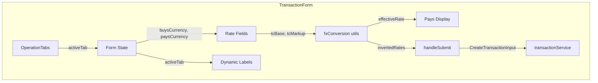
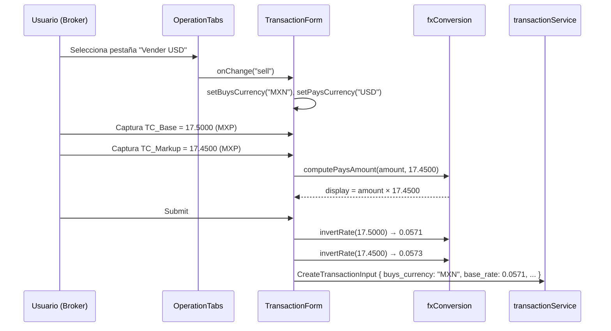

# Documento de Diseño — Tabs Compra/Venta USD en Registro de Transacción FX

## Resumen

Este diseño detalla las modificaciones al componente `TransactionForm.tsx` para reemplazar el dropdown de selección de moneda por un componente de tabs ("Compra USD" / "Vender USD"), implementar la conversión inversa transparente del tipo de cambio para operaciones de venta, y ajustar las etiquetas y cálculos según la pestaña activa. No se requieren cambios en backend ni en el modelo de datos `CreateTransactionInput`.

## Arquitectura

### Diagrama de Componentes



### Flujo de Datos



## Componentes e Interfaces

### 1. Nuevo componente: `OperationTabs`

Ubicación: `credit-scoring/src/features/fx-transactions/components/OperationTabs.tsx`

```typescript
export type OperationTab = 'buy' | 'sell';

export interface OperationTabsProps {
  activeTab: OperationTab;
  onChange: (tab: OperationTab) => void;
  disabled?: boolean;
}
```

Responsabilidades:
- Renderizar dos pestañas mutuamente excluyentes: "Compra USD" (`buy`) y "Vender USD" (`sell`)
- Manejar atributos ARIA: `role="tablist"` en el contenedor, `role="tab"` y `aria-selected` en cada pestaña
- Soportar navegación por teclado (Tab, Enter, Espacio)
- Respetar prop `disabled` para modo readOnly
- Aplicar estilos: pestaña activa con fondo primario y texto blanco, inactiva con borde y fondo transparente
- Cada pestaña ocupa 50% del ancho del contenedor

### 2. Nuevo módulo de utilidades: `fxConversion`

Ubicación: `credit-scoring/src/features/fx-transactions/utils/fxConversion.ts`

```typescript
/**
 * Invierte un tipo de cambio: 1 / rate.
 * Precondición: rate > 0
 */
export function invertRate(rate: number): number;

/**
 * Calcula el monto a pagar: amount × rate.
 * Usado para display, siempre con el rate capturado por el usuario (sin invertir).
 */
export function computePaysAmount(amount: number, rate: number): number;

/**
 * Transforma los rates según la pestaña activa para envío al backend.
 * - 'buy': retorna rates sin modificar
 * - 'sell': retorna 1/baseRate, 1/markupRate
 */
export function transformRatesForSubmit(
  tab: OperationTab,
  baseRate: number,
  markupRate: number,
): { base_rate: number; markup_rate: number; exchange_rate: number };

/**
 * Deriva la pestaña activa a partir de buys_currency de una transacción existente.
 * 'USD' → 'buy', 'MXN' → 'sell'
 */
export function deriveTabFromCurrency(buysCurrency: FXCurrency): OperationTab;

/**
 * Retorna las currencies correspondientes a una pestaña.
 * 'buy' → { buys: 'USD', pays: 'MXN' }
 * 'sell' → { buys: 'MXN', pays: 'USD' }
 */
export function getCurrenciesForTab(tab: OperationTab): {
  buysCurrency: FXCurrency;
  paysCurrency: FXCurrency;
};
```

### 3. Modificaciones a `TransactionForm.tsx`

Cambios principales:
- Reemplazar el `<select>` de moneda por `<OperationTabs>`
- Agregar estado `activeTab: OperationTab` (derivado de `initialData?.buys_currency` en modo edición)
- Modificar `handleSubmit` para usar `transformRatesForSubmit()` antes de construir `CreateTransactionInput`
- Actualizar etiquetas dinámicas según `activeTab`:
  - Campo monto compra: "Compra (USD)" / "Vende (USD)"
  - Campo monto pago: "Paga (MXN)" / "Recibe (MXN)"
  - Labels TC: siempre "(MXP por USD)"
- Agregar validación: si `activeTab === 'sell'` y rate === 0, mostrar error "Tipo de cambio debe ser mayor a 0"
- El cálculo de display `paysDisplay` siempre usa `amount × markupRate` (el valor capturado, sin invertir)

### 4. Sin cambios en:
- `CreateTransactionInput` (misma interfaz)
- `transactionService.ts` (misma API)
- `CreateTransactionPage.tsx` / `EditTransactionPage.tsx` (consumen `TransactionForm` sin cambios en props)

## Modelos de Datos

No se modifican los modelos de datos existentes. La interfaz `CreateTransactionInput` permanece idéntica:

```typescript
interface CreateTransactionInput {
  company_id: string;
  payment_account_id: string;
  buys_currency: FXCurrency;    // 'USD' (Compra) | 'MXN' (Vender)
  buys_usd: number;
  base_rate: number;            // Directo en Compra, invertido (1/TC) en Vender
  markup_rate: number;          // Directo en Compra, invertido (1/TC) en Vender
  exchange_rate: number;        // = markup_rate efectivo
  pays_currency: FXCurrency;    // 'MXN' (Compra) | 'USD' (Vender)
}
```

### Tabla de transformación por pestaña

| Campo              | Pestaña "Compra USD"       | Pestaña "Vender USD"          |
|--------------------|----------------------------|-------------------------------|
| `buys_currency`    | `"USD"`                    | `"MXN"`                       |
| `pays_currency`    | `"MXN"`                    | `"USD"`                       |
| `base_rate`        | TC_Base (tal cual)         | `1 / TC_Base`                 |
| `markup_rate`      | TC_Markup (tal cual)       | `1 / TC_Markup`               |
| `exchange_rate`    | TC_Markup (tal cual)       | `1 / TC_Markup`               |
| Display Pago       | `amount × TC_Markup`       | `amount × TC_Markup`          |
| Label Compra       | "Compra (USD)"             | "Vende (USD)"                 |
| Label Pago         | "Paga (MXN)"              | "Recibe (MXN)"                |

## Propiedades de Correctitud

*Una propiedad es una característica o comportamiento que debe mantenerse verdadero en todas las ejecuciones válidas de un sistema — esencialmente, una declaración formal sobre lo que el sistema debe hacer. Las propiedades sirven como puente entre especificaciones legibles por humanos y garantías de correctitud verificables por máquina.*

### Propiedad 1: Round-trip de la inversión del tipo de cambio

*Para cualquier* tipo de cambio `rate > 0`, aplicar `invertRate(invertRate(rate))` SHALL producir un valor igual al `rate` original con una tolerancia de ±0.0001.

**Valida: Requerimientos 4.4**

### Propiedad 2: Transformación de rates según pestaña

*Para cualquier* tipo de cambio `baseRate > 0` y `markupRate > 0`, y para cualquier pestaña activa:
- Si la pestaña es `'buy'`, `transformRatesForSubmit('buy', baseRate, markupRate)` SHALL retornar `base_rate === baseRate` y `markup_rate === markupRate` exactamente.
- Si la pestaña es `'sell'`, `transformRatesForSubmit('sell', baseRate, markupRate)` SHALL retornar `base_rate === 1/baseRate` y `markup_rate === 1/markupRate`.

**Valida: Requerimientos 2.2, 2.3, 4.2, 4.3**

### Propiedad 3: Cálculo de monto a pagar

*Para cualquier* monto `amount > 0` y tipo de cambio `rate > 0`, `computePaysAmount(amount, rate)` SHALL retornar `amount × rate` redondeado a 2 decimales, independientemente de la pestaña activa.

**Valida: Requerimientos 3.1, 3.2**

### Propiedad 4: Preservación de validación de markup negativo tras inversión

*Para cualquier* par de rates `baseRate > 0` y `markupRate > 0` donde `markupRate < baseRate` (markup negativo en MXP), después de aplicar `transformRatesForSubmit('sell', baseRate, markupRate)`, el `markup_rate` resultante SHALL ser mayor que el `base_rate` resultante (la relación se invierte porque `1/smaller > 1/larger`).

**Valida: Requerimientos 4.5**

## Manejo de Errores

| Escenario | Comportamiento |
|-----------|---------------|
| TC_Base o TC_Markup = 0 en pestaña "Vender USD" | Mostrar validación "Tipo de cambio debe ser mayor a 0". No intentar `1/0`. |
| TC_Base o TC_Markup vacío | Validación existente: "Tipo de cambio base es requerido" / "Tipo de cambio markup es requerido" |
| TC_Base o TC_Markup negativo | Validación existente: "Debe ser mayor a 0" |
| Markup negativo (markup_rate < base_rate) para broker | Validación existente preservada. Se evalúa sobre los valores invertidos en pestaña "Vender USD". |
| Pérdida de precisión en inversión | Tolerancia de ±0.0001 aceptada. Se usa `Math.round(x * 10000) / 10000` para 4 decimales. |

## Estrategia de Testing

### Testing Framework
- Vitest (ya configurado en el proyecto)
- `fast-check` para property-based testing

### Tests Unitarios (example-based)

Cubren los criterios clasificados como EXAMPLE y EDGE_CASE:

1. `OperationTabs` renderiza dos pestañas con labels correctos
2. Pestaña "Compra USD" seleccionada por defecto en modo creación
3. Click en pestaña cambia `buys_currency` / `pays_currency` correctamente
4. Modo edición deriva pestaña correcta desde `buys_currency`
5. Modo readOnly muestra tabs pero no permite cambio
6. Atributos ARIA presentes (`role="tablist"`, `role="tab"`, `aria-selected`)
7. Labels TC muestran "(MXP por USD)" en ambas pestañas
8. Valor capturado no se muestra invertido al usuario en pestaña "Vender USD"
9. Validación muestra error cuando TC = 0 en pestaña "Vender USD"
10. Recálculo de monto al cambiar de pestaña
11. Labels dinámicos: "Compra (USD)" / "Vende (USD)" y "Paga (MXN)" / "Recibe (MXN)"
12. `CreateTransactionInput` mantiene estructura de campos existente
13. `deriveTabFromCurrency('USD')` retorna `'buy'`, `deriveTabFromCurrency('MXN')` retorna `'sell'`

### Tests de Propiedades (property-based)

Cada propiedad se implementa como un test con `fast-check`, mínimo 100 iteraciones.

| Test | Propiedad | Tag |
|------|-----------|-----|
| `invertRate` round-trip | Propiedad 1 | Feature: fx-transaction-tabs, Property 1: Round-trip inversión |
| `transformRatesForSubmit` por pestaña | Propiedad 2 | Feature: fx-transaction-tabs, Property 2: Transformación rates |
| `computePaysAmount` cálculo | Propiedad 3 | Feature: fx-transaction-tabs, Property 3: Cálculo monto pago |
| Markup negativo tras inversión | Propiedad 4 | Feature: fx-transaction-tabs, Property 4: Markup negativo inversión |

Configuración de `fast-check`:
```typescript
fc.assert(
  fc.property(
    fc.double({ min: 0.0001, max: 100, noNaN: true }),
    (rate) => { /* ... */ }
  ),
  { numRuns: 100 }
);
```
