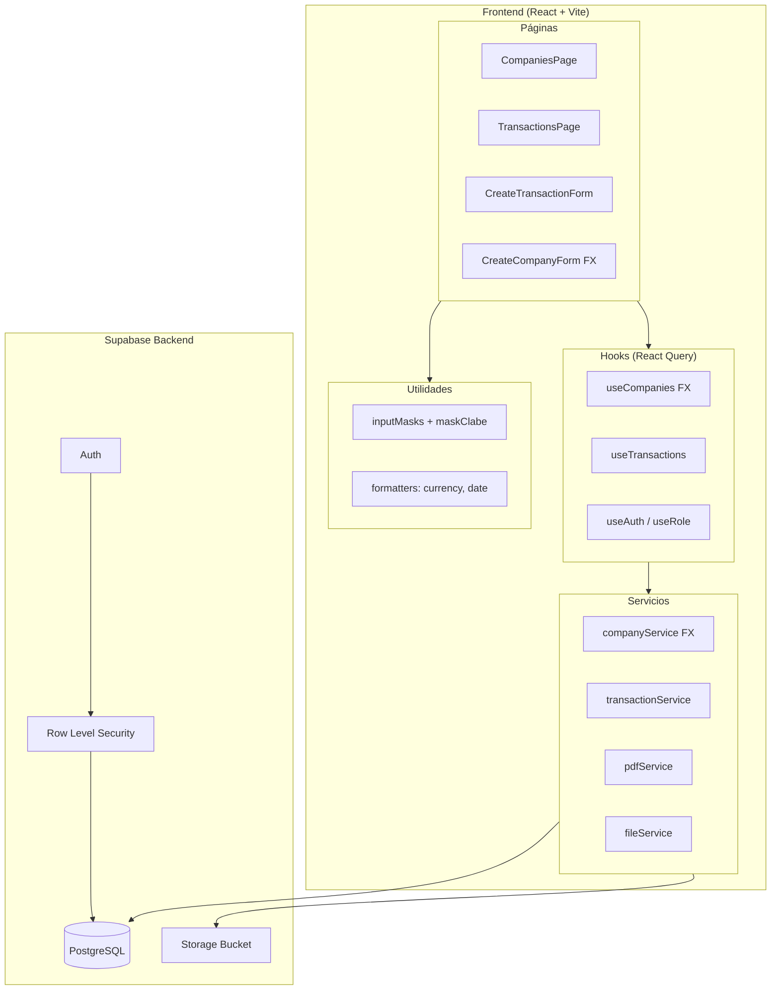
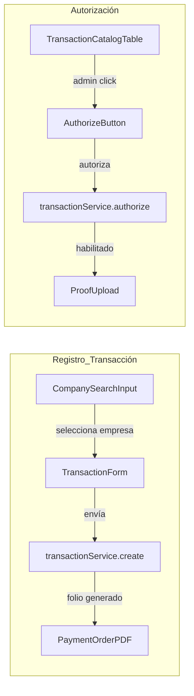
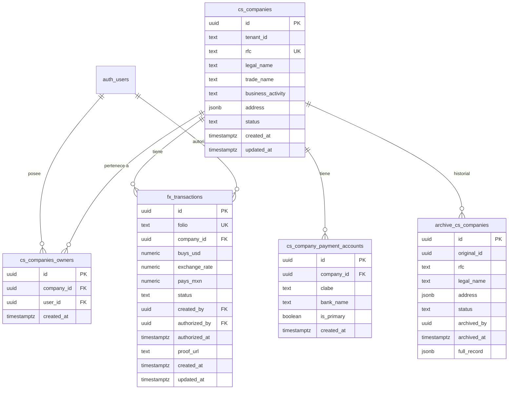

# Documento de Diseño — Transacciones FX (Xending Capital)

## Resumen General

Este documento describe el diseño técnico del módulo de Transacciones FX para Xending Capital. El módulo extiende la plataforma existente (React + TypeScript + Vite + Supabase) con funcionalidad para gestionar empresas clientes, registrar operaciones de compra-venta de divisas (USD→MXN), generar órdenes de pago en PDF, autorizar transacciones y cargar comprobantes de pago.

El diseño sigue los patrones ya establecidos en el proyecto: feature folders bajo `src/features/`, servicios Supabase, hooks con React Query, y componentes React con Tailwind CSS. Se reutilizan las máscaras de entrada existentes (`maskRfc`, `maskPhone`) y se agrega `maskClabe`.

## Arquitectura

### Diagrama de Arquitectura General



### Decisiones de Arquitectura

1. **Feature folder `fx-transactions`**: Se crea `src/features/fx-transactions/` con la misma estructura que `onboarding/` (components, hooks, pages, services, types). Esto mantiene la separación de responsabilidades y permite evolución independiente.

2. **Extensión de `cs_companies` vs nueva tabla**: Se extienden los campos de `cs_companies` (dirección fiscal, cuentas CLABE) en lugar de crear una tabla separada. Esto evita JOINs innecesarios y mantiene la empresa como entidad central.

3. **Tabla `fx_transactions` nueva**: Las transacciones FX se almacenan en una tabla dedicada con referencia a `cs_companies.id`. El folio se genera con una secuencia PostgreSQL.

4. **PDF client-side**: La generación de PDF se realiza en el frontend usando una librería como `jspdf` para evitar dependencia de funciones serverless. La plantilla se replica programáticamente.

5. **Supabase Storage para comprobantes**: Los archivos de comprobante se almacenan en un bucket de Supabase Storage con políticas de acceso basadas en RLS.

6. **React Query para estado del servidor**: Se mantiene el patrón existente con `@tanstack/react-query` para cache, invalidación y sincronización.

## Componentes e Interfaces

### Estructura de Archivos

```
credit-scoring/src/features/fx-transactions/
├── components/
│   ├── CompanySearchInput.tsx      # Buscador de empresas con autocompletado
│   ├── CompanyFormFX.tsx           # Formulario de registro/edición de empresa
│   ├── CompanyCatalogTable.tsx     # Tabla del catálogo de empresas
│   ├── TransactionForm.tsx         # Formulario de registro de transacción
│   ├── TransactionCatalogTable.tsx # Tabla del catálogo de transacciones
│   ├── PaymentOrderPDF.tsx         # Generación y descarga de PDF
│   ├── ProofUpload.tsx             # Drag-and-drop para comprobante
│   └── AuthorizeButton.tsx         # Botón de autorización (solo admin)
├── hooks/
│   ├── useCompaniesFX.ts           # Queries/mutations de empresas FX
│   ├── useTransactions.ts          # Queries/mutations de transacciones
│   ├── useRole.ts                  # Hook para determinar rol del usuario
│   └── useFileUpload.ts            # Hook para carga de archivos a Storage
├── pages/
│   ├── CompanyCatalogPage.tsx      # Página catálogo de empresas
│   ├── TransactionCatalogPage.tsx  # Página catálogo de transacciones
│   └── CreateTransactionPage.tsx   # Página registro de transacción
├── services/
│   ├── companyServiceFX.ts         # CRUD empresas con campos FX
│   ├── transactionService.ts       # CRUD transacciones FX
│   ├── pdfService.ts               # Generación de orden de pago PDF
│   └── fileService.ts              # Upload/download de comprobantes
└── types/
    ├── company-fx.types.ts         # Tipos extendidos de empresa
    └── transaction.types.ts        # Tipos de transacción FX
```

### Flujo de Componentes



### Interfaces de Componentes Principales

```typescript
// CompanySearchInput
interface CompanySearchInputProps {
  onSelect: (company: CompanyFX) => void;
  disabled?: boolean;
}

// TransactionForm
interface TransactionFormProps {
  onSubmit: (input: CreateTransactionInput) => void;
  isLoading: boolean;
  error: string | null;
}

// ProofUpload
interface ProofUploadProps {
  transactionId: string;
  isAuthorized: boolean;
  existingProofUrl: string | null;
  onUploadComplete: (url: string) => void;
}

// AuthorizeButton
interface AuthorizeButtonProps {
  transactionId: string;
  isAdmin: boolean;
  onAuthorized: () => void;
}
```


### Rutas (React Router)

Se agregan las siguientes rutas dentro del layout existente `CreditScoringLayout`:

```typescript
<Route path="fx/companies" element={<CompanyCatalogPage />} />
<Route path="fx/companies/new" element={<CompanyFormFXPage mode="create" />} />
<Route path="fx/companies/:id/edit" element={<CompanyFormFXPage mode="edit" />} />
<Route path="fx/transactions" element={<TransactionCatalogPage />} />
<Route path="fx/transactions/new" element={<CreateTransactionPage />} />
```

## Modelos de Datos

### Diagrama Entidad-Relación



### Tabla `cs_company_payment_accounts`

Almacena las cuentas de pago CLABE de cada empresa. Se separa de `cs_companies` para permitir múltiples cuentas por empresa (Req 1.6).

```sql
CREATE TABLE cs_company_payment_accounts (
    id UUID PRIMARY KEY DEFAULT gen_random_uuid(),
    company_id UUID NOT NULL REFERENCES cs_companies(id) ON DELETE CASCADE,
    clabe TEXT NOT NULL CHECK (length(replace(clabe, '-', '')) = 18),
    bank_name TEXT,
    is_primary BOOLEAN DEFAULT false,
    created_at TIMESTAMPTZ DEFAULT now()
);

CREATE INDEX idx_payment_accounts_company ON cs_company_payment_accounts(company_id);
```

### Tabla `fx_transactions`

Almacena cada operación de compra de divisas con su ciclo de vida completo.

```sql
CREATE SEQUENCE fx_transaction_folio_seq START 1;

CREATE TABLE fx_transactions (
    id UUID PRIMARY KEY DEFAULT gen_random_uuid(),
    folio TEXT UNIQUE NOT NULL DEFAULT 'XG-' || to_char(now(), 'YY') || '-' || lpad(nextval('fx_transaction_folio_seq')::text, 4, '0'),
    company_id UUID NOT NULL REFERENCES cs_companies(id),
    buys_usd NUMERIC(15, 2) NOT NULL CHECK (buys_usd > 0),
    exchange_rate NUMERIC(10, 4) NOT NULL CHECK (exchange_rate > 0),
    pays_mxn NUMERIC(15, 2) NOT NULL GENERATED ALWAYS AS (buys_usd * exchange_rate) STORED,
    status TEXT NOT NULL DEFAULT 'pending' CHECK (status IN ('pending', 'authorized', 'completed')),
    created_by UUID NOT NULL REFERENCES auth.users(id),
    authorized_by UUID REFERENCES auth.users(id),
    authorized_at TIMESTAMPTZ,
    proof_url TEXT,
    created_at TIMESTAMPTZ DEFAULT now(),
    updated_at TIMESTAMPTZ DEFAULT now()
);

CREATE INDEX idx_fx_transactions_company ON fx_transactions(company_id);
CREATE INDEX idx_fx_transactions_status ON fx_transactions(status);
CREATE INDEX idx_fx_transactions_created_by ON fx_transactions(created_by);
```

### Schema `archive` y tabla `archive.cs_companies`

```sql
CREATE SCHEMA IF NOT EXISTS archive;

CREATE TABLE archive.cs_companies (
    id UUID PRIMARY KEY DEFAULT gen_random_uuid(),
    original_id UUID NOT NULL,
    full_record JSONB NOT NULL,
    archived_by UUID NOT NULL REFERENCES auth.users(id),
    archived_at TIMESTAMPTZ DEFAULT now()
);

-- Solo INSERT permitido (sin UPDATE ni DELETE)
REVOKE UPDATE, DELETE ON archive.cs_companies FROM PUBLIC;

-- Trigger para archivar antes de UPDATE
CREATE OR REPLACE FUNCTION archive_company_on_update()
RETURNS TRIGGER AS $$
BEGIN
    INSERT INTO archive.cs_companies (original_id, full_record, archived_by)
    VALUES (OLD.id, to_jsonb(OLD), current_setting('app.current_user_id')::uuid);
    RETURN NEW;
END;
$$ LANGUAGE plpgsql;

CREATE TRIGGER trg_archive_company
    BEFORE UPDATE ON cs_companies
    FOR EACH ROW
    EXECUTE FUNCTION archive_company_on_update();
```

### Row Level Security (RLS)

```sql
-- cs_companies: Broker solo ve sus empresas, Admin ve todas
ALTER TABLE cs_companies ENABLE ROW LEVEL SECURITY;

CREATE POLICY "admin_full_access" ON cs_companies
    FOR ALL USING (
        (SELECT role FROM auth.users WHERE id = auth.uid()) = 'admin'
    );

CREATE POLICY "broker_own_companies" ON cs_companies
    FOR ALL USING (
        EXISTS (
            SELECT 1 FROM cs_companies_owners
            WHERE company_id = cs_companies.id
            AND user_id = auth.uid()
        )
    );

-- fx_transactions: Broker solo ve transacciones de sus empresas
ALTER TABLE fx_transactions ENABLE ROW LEVEL SECURITY;

CREATE POLICY "admin_full_access_tx" ON fx_transactions
    FOR ALL USING (
        (SELECT role FROM auth.users WHERE id = auth.uid()) = 'admin'
    );

CREATE POLICY "broker_own_transactions" ON fx_transactions
    FOR SELECT USING (
        EXISTS (
            SELECT 1 FROM cs_companies_owners
            WHERE company_id = fx_transactions.company_id
            AND user_id = auth.uid()
        )
    );

CREATE POLICY "broker_create_transactions" ON fx_transactions
    FOR INSERT WITH CHECK (
        EXISTS (
            SELECT 1 FROM cs_companies_owners
            WHERE company_id = fx_transactions.company_id
            AND user_id = auth.uid()
        )
    );
```

### Tipos TypeScript

```typescript
// types/company-fx.types.ts
export interface PaymentAccount {
  id: string;
  company_id: string;
  clabe: string;
  bank_name: string | null;
  is_primary: boolean;
  created_at: string;
}

export interface CompanyFX extends Company {
  payment_accounts?: PaymentAccount[];
  owner_name?: string;        // JOIN para catálogo admin
  total_buys_usd?: number;    // Agregado para catálogo
  last_transaction_at?: string; // Agregado para catálogo
}

export interface CreateCompanyFXInput {
  rfc: string;
  legal_name: string;
  trade_name?: string;
  business_activity: string;
  phone?: string;
  address: CompanyAddress;
  payment_accounts: Array<{ clabe: string; bank_name?: string }>;
  contact_email: string;
  contact_name?: string;
}

// types/transaction.types.ts
export type TransactionStatus = 'pending' | 'authorized' | 'completed';

export interface FXTransaction {
  id: string;
  folio: string;
  company_id: string;
  buys_usd: number;
  exchange_rate: number;
  pays_mxn: number;
  status: TransactionStatus;
  created_by: string;
  authorized_by: string | null;
  authorized_at: string | null;
  proof_url: string | null;
  created_at: string;
  updated_at: string;
}

export interface FXTransactionSummary extends FXTransaction {
  company_legal_name: string;
  company_rfc: string;
  broker_name: string | null;
  authorized_by_name: string | null;
}

export interface CreateTransactionInput {
  company_id: string;
  payment_account_id: string;
  buys_usd: number;
  exchange_rate: number;
}
```

### Supabase Storage — Bucket de Comprobantes

```
Bucket: fx-proofs
  Políticas:
    - INSERT: usuario autenticado, transacción autorizada y vinculada a su empresa
    - SELECT: usuario autenticado, transacción vinculada a su empresa o admin
  Estructura de archivos: fx-proofs/{transaction_id}/{filename}
  Límite: 10 MB por archivo
  Tipos permitidos: image/jpeg, image/png, application/pdf
```


## Propiedades de Correctitud

*Una propiedad es una característica o comportamiento que debe mantenerse verdadero en todas las ejecuciones válidas de un sistema — esencialmente, una declaración formal sobre lo que el sistema debe hacer. Las propiedades sirven como puente entre especificaciones legibles por humanos y garantías de correctitud verificables por máquina.*

### Propiedad 1: Round-trip de maskClabe

*Para toda* cadena de exactamente 18 dígitos numéricos, aplicar `maskClabe` y luego extraer únicamente los dígitos del resultado debe producir la cadena original de 18 dígitos.

**Valida: Requerimientos 10.1, 10.2, 10.3, 10.5, 1.4**

### Propiedad 2: Validación de RFC acepta válidos y rechaza inválidos

*Para toda* cadena generada aleatoriamente, la validación de RFC debe aceptarla si y solo si coincide con `RFC_3_REGEX` (12 caracteres, persona moral) o `RFC_4_REGEX` (13 caracteres, persona física). Además, `maskRfc` aplicado a cualquier cadena debe producir solo caracteres válidos para RFC.

**Valida: Requerimientos 1.2**

### Propiedad 3: Creación de empresa genera registro, relación de propiedad y cuentas

*Para toda* entrada válida de empresa con N cuentas CLABE (N ≥ 1), la creación debe resultar en: un registro en `cs_companies`, una relación en `cs_companies_owners` vinculando al broker creador, y exactamente N registros en `cs_company_payment_accounts`.

**Valida: Requerimientos 1.1, 1.6**

### Propiedad 4: Rechazo de RFC duplicado

*Para todo* RFC que ya existe en `cs_companies`, intentar crear una nueva empresa con ese mismo RFC debe fallar con un error indicando duplicado.

**Valida: Requerimientos 1.5**

### Propiedad 5: Propiedad determina acceso de edición del broker

*Para todo* broker y toda empresa, el broker puede editar la empresa si y solo si existe una relación en `cs_companies_owners` entre ambos. El administrador puede editar cualquier empresa sin restricción de propiedad.

**Valida: Requerimientos 2.1, 2.3, 2.5**

### Propiedad 6: Archivo histórico preserva estado previo en cada actualización

*Para toda* actualización de un registro en `cs_companies`, debe existir un nuevo registro en `archive.cs_companies` cuyo `full_record` sea igual al estado del registro antes de la actualización, con `archived_by` y `archived_at` correctos.

**Valida: Requerimientos 2.2, 3.2**

### Propiedad 7: Historial de archivo ordenado por fecha descendente

*Para toda* empresa con múltiples registros en `archive.cs_companies`, la consulta del historial debe retornar los registros ordenados por `archived_at` en orden descendente (más reciente primero).

**Valida: Requerimientos 3.4**

### Propiedad 8: Empresas deshabilitadas excluidas de búsqueda de transacciones

*Para toda* empresa con estado `disabled`, dicha empresa no debe aparecer en los resultados de búsqueda del formulario de registro de transacciones, independientemente del término de búsqueda.

**Valida: Requerimientos 4.3, 4.5, 5.3**

### Propiedad 9: Round-trip de deshabilitar/habilitar empresa

*Para toda* empresa activa, deshabilitarla y luego reactivarla debe restaurar su estado a `active`, permitiendo nuevamente su selección en transacciones.

**Valida: Requerimientos 4.6**

### Propiedad 10: Búsqueda de empresas coincide por razón social o RFC

*Para toda* empresa activa y cualquier subcadena de su `legal_name` o `rfc`, la búsqueda con esa subcadena debe incluir a la empresa en los resultados.

**Valida: Requerimientos 5.1**

### Propiedad 11: Pays es invariante del producto Buys × Exchange Rate

*Para todo* par de valores `buys_usd` > 0 y `exchange_rate` > 0 (con hasta 4 decimales de precisión), el campo `pays_mxn` calculado debe ser igual a `buys_usd * exchange_rate`, redondeado a 2 decimales.

**Valida: Requerimientos 5.5, 5.6**

### Propiedad 12: Creación de transacción genera folio único y estado pendiente

*Para toda* transacción creada con datos válidos, el registro resultante debe tener un `folio` no nulo y único, `status` igual a `'pending'`, `authorized_by` nulo y `proof_url` nulo.

**Valida: Requerimientos 5.7**

### Propiedad 13: Validación rechaza formularios incompletos

*Para todo* envío de formulario de transacción donde falte `company_id`, `buys_usd` o `exchange_rate`, la operación debe fallar con errores de validación sin crear ningún registro.

**Valida: Requerimientos 5.8**

### Propiedad 14: PDF de orden de pago contiene todos los campos requeridos

*Para toda* transacción con folio asignado, el PDF generado debe contener: folio, razón social, RFC, dirección fiscal, cuenta CLABE, monto USD, tipo de cambio, monto MXN y fecha.

**Valida: Requerimientos 6.2**

### Propiedad 15: Autorización registra identidad del admin y timestamp

*Para toda* transacción autorizada por un administrador, el registro debe tener `authorized_by` igual al UUID del administrador y `authorized_at` con un timestamp no nulo posterior a `created_at`.

**Valida: Requerimientos 7.1**

### Propiedad 16: Carga de comprobante habilitada si y solo si la transacción está autorizada

*Para toda* transacción, la carga de comprobante debe estar habilitada si `status` es `'authorized'` o `'completed'`, y deshabilitada si `status` es `'pending'`.

**Valida: Requerimientos 7.2, 7.3**

### Propiedad 17: Solo el rol administrador puede autorizar transacciones

*Para todo* usuario que intente autorizar una transacción, la operación debe tener éxito si y solo si el usuario tiene rol `admin`. Usuarios con rol `broker` deben recibir un error de permisos.

**Valida: Requerimientos 7.4, 7.5**

### Propiedad 18: Upload exitoso vincula proof_url a la transacción

*Para toda* carga exitosa de comprobante, el registro de la transacción debe tener `proof_url` no nulo apuntando al archivo subido, y el `status` debe cambiar a `'completed'`.

**Valida: Requerimientos 8.2**

### Propiedad 19: Validación de archivo acepta solo JPEG/PNG/PDF bajo 10 MB

*Para todo* archivo, la validación debe aceptarlo si y solo si su tipo MIME es `image/jpeg`, `image/png` o `application/pdf` Y su tamaño es ≤ 10 MB. Archivos que no cumplan deben ser rechazados con mensaje indicando el motivo.

**Valida: Requerimientos 8.4, 8.5**

### Propiedad 20: Agrupación de transacciones por estado

*Para todo* conjunto de transacciones, la función de agrupación debe clasificarlas en exactamente tres grupos: "No Autorizadas" (status = `'pending'`), "Autorizadas sin Comprobante" (status = `'authorized'`, proof_url nulo) e "Historial" (status = `'completed'`, proof_url no nulo). Cada transacción debe pertenecer a exactamente un grupo.

**Valida: Requerimientos 9.1**

### Propiedad 21: Broker solo ve empresas y transacciones propias

*Para todo* broker, las consultas de empresas y transacciones deben retornar únicamente registros donde exista una relación en `cs_companies_owners` entre la empresa y el broker.

**Valida: Requerimientos 4.2, 9.2**

### Propiedad 22: Formato de moneda con prefijo y separadores de miles

*Para todo* número positivo, la función de formato de moneda debe producir una cadena con el prefijo de moneda correspondiente (USD o MXN), separadores de miles y exactamente 2 decimales.

**Valida: Requerimientos 5.4**


## Manejo de Errores

### Errores de Validación (Frontend)

| Escenario | Mensaje | Acción |
|-----------|---------|--------|
| RFC inválido | "RFC debe tener 12 (moral) o 13 (física) caracteres válidos" | Bloquear envío, resaltar campo |
| CLABE inválida | "CLABE debe contener exactamente 18 dígitos" | Bloquear envío, resaltar campo |
| RFC duplicado | "Ya existe una empresa con este RFC" | Bloquear envío, mostrar alerta |
| Campos requeridos vacíos | "Este campo es requerido" | Bloquear envío, resaltar campos |
| Exchange Rate fuera de rango | "Tipo de cambio debe ser mayor a 0" | Bloquear envío |
| Buys ≤ 0 | "Monto USD debe ser mayor a 0" | Bloquear envío |
| Archivo > 10 MB | "El archivo excede el tamaño máximo de 10 MB" | Rechazar archivo |
| Tipo de archivo no soportado | "Solo se aceptan archivos JPEG, PNG o PDF" | Rechazar archivo |

### Errores de Servicio (Supabase)

| Escenario | Estrategia |
|-----------|-----------|
| Error de red | Mostrar toast de error con opción de reintentar |
| Error de RLS (permisos) | Mostrar "No tienes permisos para esta acción" |
| Error de constraint (FK, unique) | Parsear mensaje de Supabase y mostrar error legible |
| Error de upload a Storage | Mostrar error y permitir reintentar carga |
| Timeout | Mostrar "La operación tardó demasiado, intenta de nuevo" |

### Rollback en Creación de Empresa

Si la creación de contactos o cuentas de pago falla después de crear la empresa, se ejecuta un rollback eliminando el registro de `cs_companies` creado. Este patrón ya existe en `companyService.ts`.

### Manejo de Concurrencia

- Las actualizaciones de empresa usan `updated_at` como campo de control optimista
- La autorización de transacciones verifica que el `status` sea `'pending'` antes de actualizar
- La carga de comprobante verifica que el `status` sea `'authorized'` antes de permitir upload

## Estrategia de Testing

### Enfoque Dual: Tests Unitarios + Tests de Propiedades

El módulo FX Transactions utiliza un enfoque dual de testing:

1. **Tests unitarios** (Vitest): Verifican ejemplos específicos, edge cases y condiciones de error
2. **Tests de propiedades** (fast-check + Vitest): Verifican propiedades universales con inputs generados aleatoriamente

Ambos son complementarios: los tests unitarios capturan bugs concretos, los tests de propiedades verifican correctitud general.

### Librería de Property-Based Testing

Se utiliza **fast-check** (`fc`) integrado con Vitest, que ya está disponible en el ecosistema del proyecto.

```bash
npm install --save-dev fast-check
```

### Configuración de Tests de Propiedades

- Mínimo **100 iteraciones** por test de propiedad
- Cada test debe referenciar la propiedad del documento de diseño
- Formato de tag: `Feature: fx-transactions, Property {N}: {título}`

### Plan de Tests

#### Tests de Propiedades (fast-check)

| Propiedad | Archivo de Test | Generadores |
|-----------|----------------|-------------|
| P1: Round-trip maskClabe | `inputMasks.test.ts` | `fc.stringOf(fc.constantFrom(...'0123456789'), {minLength:18, maxLength:18})` |
| P2: Validación RFC | `inputMasks.test.ts` | `fc.string()` + generador de RFCs válidos |
| P11: Pays = Buys × Rate | `transactionCalc.test.ts` | `fc.float({min:0.01, max:999999})` × `fc.float({min:0.0001, max:99.9999})` |
| P12: Folio único y estado pendiente | `transactionService.test.ts` | Generador de `CreateTransactionInput` |
| P13: Validación rechaza incompletos | `transactionValidation.test.ts` | Generador de inputs parciales |
| P19: Validación de archivo | `fileValidation.test.ts` | Generador de `{type, size}` |
| P20: Agrupación de transacciones | `transactionGrouping.test.ts` | `fc.array(generadorTransaccion)` |
| P22: Formato de moneda | `formatters.test.ts` | `fc.float({min:0.01, max:99999999})` |

#### Tests Unitarios (Vitest)

| Área | Archivo de Test | Casos |
|------|----------------|-------|
| maskClabe edge cases | `inputMasks.test.ts` | Cadena vacía, menos de 18 dígitos, caracteres mixtos |
| Creación de empresa | `companyServiceFX.test.ts` | Happy path, RFC duplicado, rollback en error |
| Autorización | `transactionService.test.ts` | Admin autoriza, broker denegado, doble autorización |
| Upload comprobante | `fileService.test.ts` | Archivo válido, tipo inválido, tamaño excedido |
| PDF generation | `pdfService.test.ts` | Verificar que todos los campos aparecen en output |
| Búsqueda de empresas | `companyServiceFX.test.ts` | Búsqueda por RFC, por nombre, empresa deshabilitada excluida |
| Agrupación transacciones | `transactionGrouping.test.ts` | Lista vacía, todas pendientes, todas completadas |

### Ejemplo de Test de Propiedad

```typescript
import { describe, it, expect } from 'vitest';
import * as fc from 'fast-check';
import { maskClabe } from './inputMasks';

describe('maskClabe', () => {
  // Feature: fx-transactions, Property 1: Round-trip de maskClabe
  it('round-trip: aplicar maskClabe y extraer dígitos produce la entrada original', () => {
    fc.assert(
      fc.property(
        fc.stringOf(fc.constantFrom(...'0123456789'.split('')), { minLength: 18, maxLength: 18 }),
        (digits) => {
          const masked = maskClabe(digits);
          const extracted = masked.replace(/[^0-9]/g, '');
          expect(extracted).toBe(digits);
        },
      ),
      { numRuns: 100 },
    );
  });
});
```
