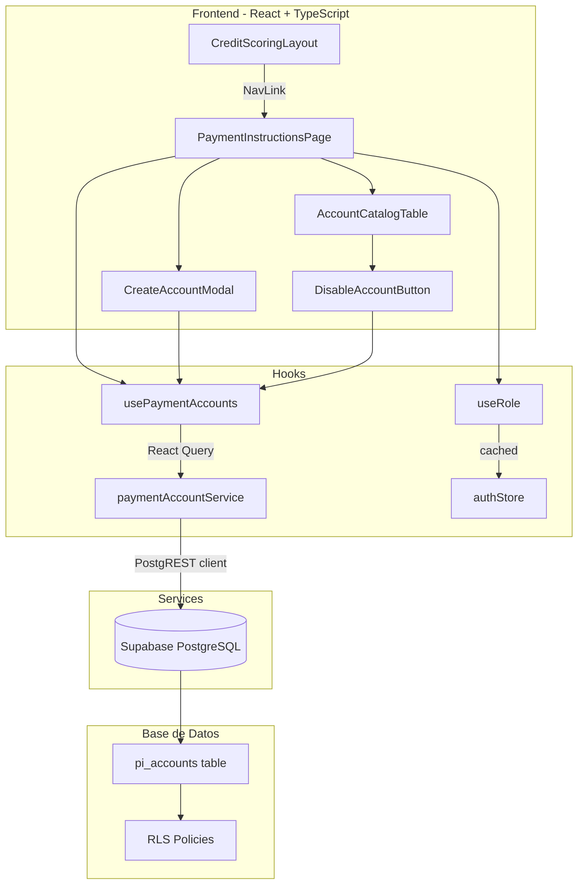

# Documento de Diseño — Payment Instructions

## Resumen

El módulo Payment Instructions agrega un catálogo de cuentas bancarias para depósito dentro de la plataforma Xending Capital. Se implementa como un nuevo feature dentro de `credit-scoring/src/features/payment-instructions/`, siguiendo los patrones existentes del proyecto (feature-based structure con pages, components, hooks, services y types).

El módulo permite a los Administradores crear y deshabilitar cuentas bancarias inmutables. Los Brokers solo pueden consultar cuentas activas. Se integra en el menú lateral existente (`CreditScoringLayout`) y utiliza la ruta `/payment-instructions`.

La arquitectura sigue los mismos patrones de `fx-transactions`: React Query para data fetching, PostgREST client para acceso a datos, Zustand para auth state, y Tailwind CSS para estilos.

## Arquitectura



### Decisiones de Diseño

1. **Modal para creación en lugar de página separada**: Se usa un modal (`CreateAccountModal`) en vez de una ruta `/payment-instructions/new` porque el formulario es simple (6 campos + checkboxes) y no justifica una navegación completa. Esto es consistente con la experiencia de catálogo.

2. **Soft delete (deshabilitación) en lugar de eliminación**: Las cuentas se marcan como `disabled` sin eliminarse, preservando el historial. El campo `is_active` controla la visibilidad.

3. **Inmutabilidad enforced en DB**: Se usa una política de base de datos que impide `UPDATE` en campos de datos, permitiendo solo cambios en `is_active`, `disabled_at` y `disabled_by`. Esto garantiza integridad independientemente del frontend.

4. **Reutilización del hook `useRole`**: Se reutiliza el hook existente en `fx-transactions/hooks/useRole.ts` para determinar permisos, manteniendo consistencia con el resto de la aplicación.

## Componentes e Interfaces

### Estructura de archivos

```
credit-scoring/src/features/payment-instructions/
├── components/
│   ├── AccountCatalogTable.tsx    # Tabla del catálogo con columnas y acciones
│   └── CreateAccountModal.tsx     # Modal con formulario de creación
├── hooks/
│   └── usePaymentInstructions.ts  # React Query hooks (list, create, disable)
├── pages/
│   └── PaymentInstructionsPage.tsx # Página principal del catálogo
├── services/
│   └── paymentAccountService.ts   # Funciones CRUD contra PostgREST
├── types/
│   └── payment-instruction.types.ts # Tipos TypeScript
└── utils/
    └── validators.ts              # Validaciones de SWIFT, Account Number, campos requeridos
```

### Componentes

**PaymentInstructionsPage** — Página principal que orquesta el catálogo.
- Usa `usePaymentAccounts()` para obtener datos
- Usa `useRole()` para determinar permisos
- Muestra botón "Nueva Cuenta" solo para admin
- Renderiza `AccountCatalogTable`
- Controla apertura/cierre de `CreateAccountModal`

**AccountCatalogTable** — Tabla del catálogo de cuentas.
- Props: `accounts`, `isAdmin`, `onDisable`
- Admin ve todas las cuentas (activas + deshabilitadas) con columna de estado y botón deshabilitar
- Broker ve solo cuentas activas sin controles de administración
- Columnas: Account Number, Account Name, SWIFT, Bank Name, Bank Address, Tipo de Cambio, Estado (admin), Acciones (admin)

**CreateAccountModal** — Modal con formulario de creación.
- Props: `isOpen`, `onClose`, `onSuccess`
- Campos: Account Number, Account Name, SWIFT, Bank Name, Bank Address
- Checkboxes para Tipo de Cambio (USD, MXN, EUR, etc.)
- Validación client-side antes de envío
- Muestra errores de validación inline

### Hooks

**usePaymentInstructions** — React Query hooks:
- `usePaymentAccounts()` — Lista cuentas (filtradas por rol via RLS)
- `useCreatePaymentAccount()` — Mutation para crear cuenta
- `useDisablePaymentAccount()` — Mutation para deshabilitar cuenta

### Services

**paymentAccountService** — Funciones async contra PostgREST:
- `getPaymentAccounts()` — SELECT con ordenamiento (activas primero, desc por fecha)
- `createPaymentAccount(input)` — INSERT con validación de duplicados
- `disablePaymentAccount(id)` — UPDATE solo del campo `is_active`, `disabled_at`, `disabled_by`

### Validadores (funciones puras)

**validators.ts**:
- `validateSWIFT(value: string): ValidationResult` — 8-11 caracteres alfanuméricos
- `validateAccountNumber(value: string): ValidationResult` — No vacío, alfanumérico
- `validateRequiredFields(input: CreateAccountInput): ValidationResult` — Todos los campos obligatorios presentes
- `validateCreateAccountForm(input: CreateAccountInput): ValidationResult` — Combina todas las validaciones

## Modelos de Datos

### Tabla `pi_accounts`

```sql
CREATE TABLE pi_accounts (
  id UUID PRIMARY KEY DEFAULT gen_random_uuid(),
  account_number TEXT NOT NULL UNIQUE,
  account_name TEXT NOT NULL,
  swift_code TEXT NOT NULL CHECK (length(swift_code) BETWEEN 8 AND 11),
  bank_name TEXT NOT NULL,
  bank_address TEXT NOT NULL,
  currency_types TEXT[] NOT NULL DEFAULT '{}',
  is_active BOOLEAN NOT NULL DEFAULT true,
  created_at TIMESTAMPTZ NOT NULL DEFAULT now(),
  created_by UUID NOT NULL,
  disabled_at TIMESTAMPTZ,
  disabled_by UUID,
  tenant_id TEXT NOT NULL DEFAULT 'xending'
);

-- Índices
CREATE INDEX idx_pi_accounts_active ON pi_accounts (is_active, created_at DESC);
CREATE INDEX idx_pi_accounts_tenant ON pi_accounts (tenant_id);
```

### Políticas RLS

```sql
-- Broker: solo lectura de cuentas activas
CREATE POLICY "broker_read_active" ON pi_accounts
  FOR SELECT
  TO authenticated
  USING (is_active = true OR current_setting('request.jwt.claims')::json->>'role' = 'admin');

-- Admin: insertar cuentas
CREATE POLICY "admin_insert" ON pi_accounts
  FOR INSERT
  TO authenticated
  WITH CHECK (current_setting('request.jwt.claims')::json->>'role' = 'admin');

-- Admin: solo puede actualizar is_active, disabled_at, disabled_by
CREATE POLICY "admin_disable_only" ON pi_accounts
  FOR UPDATE
  TO authenticated
  USING (current_setting('request.jwt.claims')::json->>'role' = 'admin')
  WITH CHECK (current_setting('request.jwt.claims')::json->>'role' = 'admin');

-- Trigger para impedir UPDATE en campos de datos
CREATE OR REPLACE FUNCTION prevent_data_field_update() RETURNS TRIGGER AS $$
BEGIN
  IF OLD.account_number IS DISTINCT FROM NEW.account_number
     OR OLD.account_name IS DISTINCT FROM NEW.account_name
     OR OLD.swift_code IS DISTINCT FROM NEW.swift_code
     OR OLD.bank_name IS DISTINCT FROM NEW.bank_name
     OR OLD.bank_address IS DISTINCT FROM NEW.bank_address
     OR OLD.currency_types IS DISTINCT FROM NEW.currency_types
  THEN
    RAISE EXCEPTION 'No se permite modificar los datos de la cuenta bancaria';
  END IF;
  RETURN NEW;
END;
$$ LANGUAGE plpgsql;

CREATE TRIGGER trg_prevent_data_update
  BEFORE UPDATE ON pi_accounts
  FOR EACH ROW
  EXECUTE FUNCTION prevent_data_field_update();
```

### Tipos TypeScript

```typescript
export interface PaymentInstructionAccount {
  id: string;
  account_number: string;
  account_name: string;
  swift_code: string;
  bank_name: string;
  bank_address: string;
  currency_types: string[];
  is_active: boolean;
  created_at: string;
  created_by: string;
  disabled_at: string | null;
  disabled_by: string | null;
}

export interface CreateAccountInput {
  account_number: string;
  account_name: string;
  swift_code: string;
  bank_name: string;
  bank_address: string;
  currency_types: string[];
}

export interface ValidationResult {
  valid: boolean;
  errors: Record<string, string>;
}
```

### Integración con Routing (App.tsx)

```tsx
// Dentro de <Route element={<ProtectedRoute />}>
//   <Route path="/" element={<CreditScoringLayout />}>
//     ...rutas existentes...
      <Route path="payment-instructions" element={<PaymentInstructionsPage />} />
//   </Route>
// </Route>
```

### Integración con Navegación (CreditScoringLayout.tsx)

```typescript
// Agregar al array NAV_ITEMS:
{ to: '/payment-instructions', label: 'Payment Instructions', icon: CreditCard, end: false },
```

## Propiedades de Correctitud

*Una propiedad es una característica o comportamiento que debe mantenerse verdadero en todas las ejecuciones válidas de un sistema — esencialmente, una declaración formal sobre lo que el sistema debe hacer. Las propiedades sirven como puente entre especificaciones legibles por humanos y garantías de correctitud verificables por máquina.*

### Propiedad 1: Validación de formato de campos

*Para cualquier* string, la función `validateSWIFT` debe aceptar únicamente strings de 8 a 11 caracteres alfanuméricos, y la función `validateAccountNumber` debe aceptar únicamente strings no vacíos compuestos exclusivamente de caracteres alfanuméricos.

**Valida: Requerimientos 1.2, 1.3**

### Propiedad 2: Validación de campos obligatorios

*Para cualquier* objeto `CreateAccountInput` al que le falte al menos un campo obligatorio (account_number, account_name, swift_code, bank_name, bank_address, currency_types), la función `validateRequiredFields` debe rechazar el input e identificar exactamente los campos faltantes.

**Valida: Requerimiento 1.4**

### Propiedad 3: Creación produce registro activo con timestamp

*Para cualquier* conjunto válido de datos de cuenta (que pase todas las validaciones), la función `createPaymentAccount` debe producir un registro con `is_active = true` y un `created_at` no nulo.

**Valida: Requerimiento 1.1**

### Propiedad 4: Inmutabilidad — actualizaciones a campos de datos son rechazadas

*Para cualquier* cuenta existente y cualquier intento de modificar un campo de datos (account_number, account_name, swift_code, bank_name, bank_address, currency_types), el sistema debe rechazar la operación.

**Valida: Requerimiento 2.1**

### Propiedad 5: Cuentas deshabilitadas excluidas de listados activos

*Para cualquier* conjunto de cuentas con estados mixtos (activas y deshabilitadas), al consultar cuentas activas, ninguna cuenta con `is_active = false` debe aparecer en los resultados.

**Valida: Requerimiento 3.3**

### Propiedad 6: Ordenamiento del catálogo

*Para cualquier* conjunto de cuentas, el resultado del ordenamiento debe colocar todas las cuentas activas antes que las deshabilitadas, y dentro de cada grupo, ordenar por `created_at` en orden descendente.

**Valida: Requerimiento 4.4**

## Manejo de Errores

| Escenario | Comportamiento | Mensaje al usuario |
|---|---|---|
| Campos obligatorios vacíos | Validación client-side impide envío | "Este campo es requerido" (inline por campo) |
| SWIFT inválido | Validación client-side impide envío | "El código SWIFT debe tener entre 8 y 11 caracteres alfanuméricos" |
| Account Number inválido | Validación client-side impide envío | "El número de cuenta debe contener solo caracteres alfanuméricos" |
| Account Number duplicado | Error de servicio (check previo al INSERT) | "Ya existe una cuenta con este número de cuenta" |
| Broker intenta crear | UI oculta el botón; servicio valida rol | "Permisos insuficientes: solo el administrador puede crear cuentas" |
| Broker intenta deshabilitar | UI oculta el control; servicio valida rol | "Permisos insuficientes: solo el administrador puede deshabilitar cuentas" |
| Error de red / PostgREST | Catch genérico en servicio | "Error al procesar la solicitud. Intenta de nuevo más tarde." |
| Intento de UPDATE en campos de datos | Trigger de DB rechaza | "No se permite modificar los datos de la cuenta bancaria" |

## Estrategia de Testing

### Tests unitarios (Vitest)

- **validators.ts**: Tests de ejemplo para cada función de validación con casos concretos (SWIFT válido/inválido, Account Number vacío, campos faltantes)
- **Componentes**: Tests de renderizado verificando que admin ve controles de administración y broker no
- **Hooks**: Tests con mocks de servicio verificando queries y mutations

### Tests de propiedades (Vitest + fast-check)

Se usará `fast-check` como librería de property-based testing con Vitest.

Cada propiedad del documento de diseño se implementará como un test con mínimo 100 iteraciones:

- **Propiedad 1**: Generar strings aleatorios, verificar que `validateSWIFT` y `validateAccountNumber` aceptan/rechazan correctamente
  - Tag: `Feature: payment-instructions, Property 1: Validación de formato de campos`
- **Propiedad 2**: Generar objetos con subconjuntos aleatorios de campos omitidos, verificar detección exacta
  - Tag: `Feature: payment-instructions, Property 2: Validación de campos obligatorios`
- **Propiedad 3**: Generar datos válidos, crear cuenta con mock, verificar `is_active` y `created_at`
  - Tag: `Feature: payment-instructions, Property 3: Creación produce registro activo con timestamp`
- **Propiedad 4**: Generar cuentas y campos a modificar, verificar rechazo
  - Tag: `Feature: payment-instructions, Property 4: Inmutabilidad`
- **Propiedad 5**: Generar conjuntos mixtos, filtrar activas, verificar exclusión de deshabilitadas
  - Tag: `Feature: payment-instructions, Property 5: Cuentas deshabilitadas excluidas`
- **Propiedad 6**: Generar conjuntos aleatorios de cuentas, aplicar ordenamiento, verificar orden correcto
  - Tag: `Feature: payment-instructions, Property 6: Ordenamiento del catálogo`

### Tests de integración

- Verificar que las políticas RLS funcionan correctamente (broker solo lee activas, admin lee todas)
- Verificar que el trigger de inmutabilidad rechaza UPDATEs en campos de datos
- Verificar que la ruta `/payment-instructions` es accesible para ambos roles

### Tests de ejemplo (UI)

- Admin ve botón "Nueva Cuenta", broker no
- Admin ve columna de estado y control de deshabilitar, broker no
- Modal de creación muestra errores de validación correctamente
- Cuenta deshabilitada muestra indicador visual
