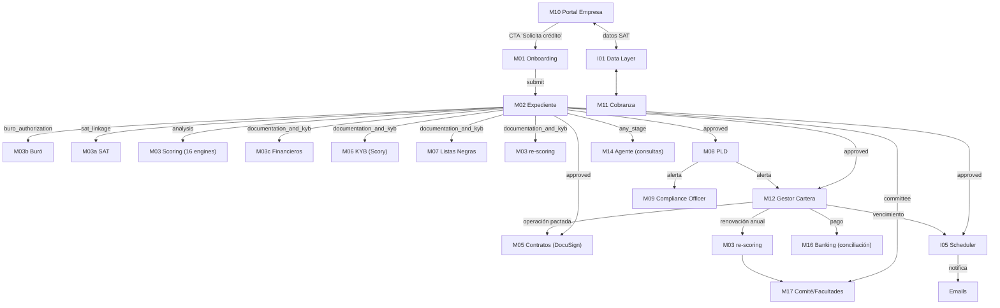

# Xending Platform — Arquitectura y Plan Maestro

## Qué es Xending Platform

Sistema modular de crédito empresarial que cubre el ciclo completo: desde que una empresa solicita crédito hasta que paga, se renueva, y se monitorea. Diseñado para operar internamente en Xending Capital (SOFOM ENR) y venderse como whitelabel a otras instituciones financieras.

## Objetivos

1. Automatizar el otorgamiento de crédito empresarial con AI y datos del SAT
2. Reducir tiempo de análisis de días a horas
3. Ofrecer herramientas gratuitas de salud financiera como gancho comercial
4. Vender la plataforma como SaaS/whitelabel a otras SOFOMs
5. Preparar todo para ser operado por agentes AI autónomos en el futuro

## Principios de diseño

### Modularidad total
Cada módulo es independiente, activable/desactivable por tenant. Se comunican por eventos, nunca se llaman directamente.

### Lógica determinista, agente solo orquesta
Toda la lógica de negocio es código TypeScript puro: funciones deterministas que dado el mismo input siempre dan el mismo output. Los agentes AI solo invocan estas funciones y presentan resultados. Nunca calculan, nunca deciden aprobaciones, nunca modifican reglas.

### AI-first (pero como capa, no como core)
AI interpreta resultados en lenguaje natural, procesa documentos (OCR), genera comunicaciones, y sirve como interfaz conversacional. Pero las decisiones de negocio las toman las funciones deterministas.

### Syntage como provider principal de datos
Syntage provee datos del SAT, Buró, Registro Público y Hawk Checks. Es el único provider por ahora. Si un cliente futuro requiere otro, se evalúa caso por caso.

---

## Flujo completo de un crédito (paso a paso real)

```
FASE 1: ORIGINACIÓN
═══════════════════

Paso 1 → M01 Onboarding
  Empresa llena formulario público (nombre, RFC, giro, ventas mensuales, línea deseada)
  Pre-filtro comercial clasifica: approved / review / rejected
  Si approved → se crea expediente, se envía email con link

Paso 2 → M02 Expediente (buro_authorization)
  Solicitante abre link, firma autorización de Buró de Crédito
  Se consulta Buró vía Syntage

Paso 3 → M02 Expediente (sat_linkage)
  Solicitante ingresa CIEC del SAT en el portal
  Syntage extrae datos: facturas, declaraciones, constancia fiscal, nómina

Paso 4 → M03 Scoring (analysis)
  16 engines de análisis corren sobre datos reales del SAT y Buró
  20 cruces inteligentes detectan patrones complejos
  Se genera score preliminar

Paso 5 → M03c + M06 + M07 (documentation_and_kyb)
  Solicitante sube financieros manuales (PDF/Excel) y documentos adicionales
  Scory ejecuta KYB: verificación de identidad empresarial
  Scory + Hawk ejecutan checks de listas negras
  Score se recalcula con toda la información

Paso 6 → M04 Decision + M17 Comité
  Score final + recomendación del sistema
  Al inicio: TODOS los casos van a comité de socios
  Futuro: auto-approve si score > umbral y monto < límite
  Comité vota: aprobar / condicionar / rechazar

Paso 7 → M05 Contratos
  Si aprobado → generar contrato con condiciones
  Enviar a firma vía DocuSign
  Cuando firma → email a admin para liberar pago

FASE 2: OPERACIÓN
═════════════════

Paso 8 → M12 Gestor de Cartera
  Se registra línea de crédito activa
  Cada operación bajo la línea genera su propio contrato
  Dos tipos de operación:

  ESTÁNDAR (2-45 días):
    Pactar → generar contrato → DocuSign → firma → liberar pago
    Alertas de vencimiento según plazo (3 días antes, 1 día antes)
    Al vencimiento: email urgente
    Si no paga: overdue → acciones de cobranza

  INTRADÍA (mismo día):
    Pactar → generar contrato (sin firma) → email confirmación
    Autorización depende del tipo de línea:
      Línea Autorizada (con estudio): NO requiere autorización de socios
      Línea de Servicio (sin estudio): SÍ requiere facultades (M17):
        Hasta $100K USD → 3 de 5 socios autorizan
        $100K-$350K USD → 4 de 5 socios
        Más de $350K USD → 5 de 5 socios
    Se concilia pago el mismo día
    No hay alertas de vencimiento

  LÍNEA REVOLVENTE:
    Tope aprobado (ej: $500K USD)
    Cada operación consume disponible
    Cuando paga → se libera disponible
    Múltiples operaciones simultáneas

FASE 3: MONITOREO
═════════════════

Paso 9 → M13 Covenant Tracking
  Revisión trimestral o semestral según riesgo
  Verificar ratios financieros, reportes, condiciones
  Si incumple → alerta al analista

Paso 10 → M08 Monitoreo PLD
  Re-check de listas negras cada 6 o 12 meses (configurable)
  Si aparece en lista → alerta crítica al compliance officer

Paso 11 → M12 Renovación anual
  30 días antes del vencimiento anual → iniciar renovación
  Re-ejecutar scoring completo con datos frescos
  Nuevo comité → aprobar renovación / modificar / cancelar
  Generar nuevo contrato de renovación
```

---

## Reglas de alertas de vencimiento (función determinista)

```
Plazo 1 día (intradía):     sin alertas
Plazo 2-7 días:             1 día antes
Plazo 8-14 días:            3 días antes + 1 día antes
Plazo 15-45 días:           5 días antes + 3 días antes + 1 día antes
```

---

## Reglas de facultades para operaciones (función determinista)

```
SOLO APLICA A LÍNEAS DE SERVICIO (sin estudio de crédito).
Líneas Autorizadas (con estudio) NO requieren autorización adicional.

Línea de Servicio — autorización por monto:
  Hasta $100,000 USD:         3 de 5 socios deben autorizar
  $100,001 - $350,000 USD:    4 de 5 socios deben autorizar
  Más de $350,000 USD:        5 de 5 socios (unanimidad)
```

---

## Catálogo completo de módulos

### Grupo A: Originación de Crédito

| ID | Módulo | Estado | Descripción |
|----|--------|--------|-------------|
| M01 | Onboarding Digital | POR CONSTRUIR | Landing pública, formulario simplificado, pre-filtro comercial, routing |
| M02 | Expediente Digital | CONSTRUIDO | State machine, tokens, portal solicitante, audit log |
| M03 | Scoring Framework | CONSTRUIDO | 16 engines + 20 cruces + pesos dinámicos (refactor pendiente) |
| M03a | Data Source: SAT | CONSTRUIDO | Datos SAT vía Syntage (facturas, declaraciones, constancia, nómina) |
| M03b | Data Source: Buró | CONSTRUIDO | Buró de Crédito vía Syntage (score, créditos, consultas) |
| M03c | Data Source: Financieros Manuales | POR CONSTRUIR | Upload PDF/Excel, OCR con AI, schema estándar |
| M03d | Data Source: Compliance | CONSTRUIDO (parcial) | PLD/KYC vía Scory + Hawk Checks vía Syntage |
| M03e | Data Source: Registro Público | CONSTRUIDO | Accionistas, RUG, estructura corporativa vía Syntage |
| M04 | Decision Engines | CONSTRUIDO | 8 engines de decisión (AI Risk, Credit Limit, Risk Matrix, etc.) |
| M05 | Contratos y Documentos | POR CONSTRUIR | Templates, generación PDF, DocuSign, múltiples contratos por línea |
| M17 | Comité y Facultades | POR CONSTRUIR | Autorización por firmas de socios, quórum configurable |

### Grupo B: Compliance y PLD

| ID | Módulo | Estado | Descripción |
|----|--------|--------|-------------|
| M06 | KYB (Scory) | POR CONSTRUIR | Verificación identidad empresarial, Agentic AI. Se ejecuta DESPUÉS del scoring |
| M07 | Listas Negras | POR CONSTRUIR | 69B, OFAC, PEPs, SYGER, Interpol, Panama Papers, 30+ fuentes |
| M08 | Monitoreo PLD | POR CONSTRUIR | Re-checks cada 6-12 meses, alertas automáticas |
| M09 | Compliance Officer | POR CONSTRUIR | Dashboard, reportes regulatorios (CNBV, UIF), workflow de revisión |

### Grupo C: Portal Empresa (Público / Freemium)

| ID | Módulo | Estado | Descripción |
|----|--------|--------|-------------|
| M10 | Portal Salud Financiera | POR CONSTRUIR | Dashboard gratuito: facturación, tendencias, indicadores con AI |
| M11 | Cobranza Inteligente | POR CONSTRUIR | Cuentas por cobrar automáticas desde SAT, antigüedad, alertas |

### Grupo D: Post-Crédito

| ID | Módulo | Estado | Descripción |
|----|--------|--------|-------------|
| M12 | Gestor de Cartera | DISEÑO COMPLETO | FX Financing + Direct Lending, líneas revolventes, operaciones bullet 2-45d, moratorios, clasificación cartera, dashboard. Ver M12_PORTFOLIO_MANAGER_V2.md |
| M13 | Covenant Tracking | ENGINE CONSTRUIDO | Seguimiento condiciones, revisión trimestral/semestral |

### Grupo E: Inteligencia y AI

| ID | Módulo | Estado | Descripción |
|----|--------|--------|-------------|
| M14 | Agente Conversacional | POR CONSTRUIR | Chat AI sobre empresa, crédito, cartera. Interfaz principal |

### Grupo F: FX y Tesorería

| ID | Módulo | Estado | Descripción |
|----|--------|--------|-------------|
| M15 | Operaciones FX | PARCIAL | Cotizador, operaciones de cambio, líneas FX vinculadas |

### Grupo G: Banking

| ID | Módulo | Estado | Descripción |
|----|--------|--------|-------------|
| M16 | Conexión Bancaria | POR CONSTRUIR | Estados de cuenta, conciliación de pagos, Open Banking |

### Infraestructura

| ID | Módulo | Estado | Descripción |
|----|--------|--------|-------------|
| I01 | Data Layer Compartido | POR CONSTRUIR | cs_companies, cs_provider_data histórico por periodo |
| I02 | Module Registry | POR CONSTRUIR | Catálogo módulos, configuración por tenant, pesos |
| I03 | Event Bus | POR CONSTRUIR | Comunicación entre módulos vía eventos |
| I04 | Tenant Management | POR CONSTRUIR | Multi-tenant, whitelabel, branding |
| I05 | Scheduled Events | POR CONSTRUIR | Eventos programados: vencimientos, renovaciones, PLD |
| I06 | API Layer | POR CONSTRUIR | API REST unificada (Supabase Edge Functions). Input/output de toda la plataforma |
| I07 | RAG | POR CONSTRUIR | Indexación de contratos, políticas, minutas, emails con pgvector |
| I08 | MCP Server | POR CONSTRUIR | Expone funciones como MCP tools para agentes AI (Claude, Kiro, etc.) |

---

## State machine del expediente (corregida)

```
pre_filter → buro_authorization → sat_linkage → analysis
→ documentation_and_kyb → committee → approved / rejected

Estados adicionales:
  manual_review    (pre-filtro borderline, analista revisa)
  expired          (token venció sin usarse, puede reactivarse)
  rejected         (cualquier etapa puede rechazar)
```

### Qué pasa en cada etapa

| Etapa | Qué pasa | Quién actúa |
|-------|----------|-------------|
| pre_filter | Pre-filtro comercial (ventas vs línea) | Sistema automático |
| buro_authorization | Firma autorización Buró + consulta | Solicitante (vía token) |
| sat_linkage | Ingresa CIEC, Syntage extrae datos SAT | Solicitante (vía token) |
| analysis | 16 engines + 20 cruces corren | Sistema automático |
| documentation_and_kyb | Sube financieros + docs + Scory KYB + listas negras. Score se recalcula | Solicitante + Sistema |
| committee | Comité de socios vota (M17 Facultades) | Socios (vía email/link) |
| approved | Línea aprobada, se generan contratos | Sistema + Admin |
| rejected | Rechazado en cualquier etapa | Sistema o Comité |

---

## Diagrama de conexión entre módulos



---

## Scoring Framework: cómo funciona

### Data Sources (configurables por tenant)

| ID | Fuente | Provider | Engines que habilita |
|----|--------|----------|---------------------|
| M03a | SAT | Syntage | sat_facturacion (14%), network (8%), stability (9%), employee (3%), fx_risk (7%) |
| M03b | Buró | Syntage | buro (10%) |
| M03c | Financieros manuales | Upload + AI OCR | financial (11%), cashflow (16%), working_capital (4%) |
| M03d | Compliance | Scory + Hawk | compliance (gate), graph_fraud (gate) |
| M03e | Registro Público | Syntage | operational (9%) |

### Pesos dinámicos + configurables

Los pesos se normalizan automáticamente al 100% según engines activos. Si un tenant desactiva Buró, el 10% de buro se redistribuye proporcionalmente. Cada tenant puede hacer override manual.

### 20 cruces inteligentes

Combinan métricas de 2+ engines para detectar patrones: rotación de deuda, empresa fachada, sobreendeudamiento, manipulación contable, etc. Si un engine requerido no está activo, el cruce se salta sin error.

---

## Productos de crédito Xending (Fase 1)

### Producto 1: FX Financing (Financiamiento con conversión cambiaria)
```
Tasa: 0% (ganancia vía spread cambiario)
Moneda desembolso: USD → Moneda pago: MXN (a TC pactado)
Plazo: 2-45 días, bullet (pago total al vencimiento)
Moratorios: 5% mensual + IVA sobre intereses
Sin pagos parciales, sin comisiones (estructura lista)

Ejemplo:
  Desembolso: $100,000 USD
  TC pactado: $20.50
  Plazo: 30 días
  Cliente paga: $2,050,000 MXN
  Ganancia: spread entre TC pactado y TC mercado
```

### Producto 2: Direct Lending (Financiamiento directo)
```
Tasa: 40% anual (misma moneda: USD→USD o MXN→MXN)
Plazo: 2-45 días, bullet
Moratorios: 5% mensual + IVA sobre intereses
Sin pagos parciales, sin comisiones (estructura lista)

Ejemplo:
  Desembolso: $100,000 USD
  Tasa: 40%/365 × 30 = 3.2877%
  Interés: $3,287.67 + IVA $526.03
  Cliente paga: $103,813.70 USD
```

### Regla automática de tasa
```
SI moneda_desembolso ≠ moneda_pago → Tasa 0% (FX Financing)
SI moneda_desembolso = moneda_pago → Tasa 40% anual (Direct Lending)
```

### Productos futuros (Fase 2+): Factoraje, Crédito Simple Empresarial
### Ver diseño completo: docs/modules/M12_PORTFOLIO_MANAGER_V2.md

---

## Tipos de operación de crédito

### Estándar (2-45 días)
```
Pactar (monto, moneda pago, plazo, TC si FX)
  → Sistema determina producto y tasa automáticamente
  → Contrato → DocuSign → Firma → Liberar pago
  → Alertas según plazo → Vencimiento → Pago total
  → Liberar disponible en línea
```

### Intradía (mismo día)
```
Pactar (monto, moneda pago, TC si FX)
  → SI Línea de Servicio: Autorización por facultades (3-5 socios según monto)
  → SI Línea Autorizada: Sin autorización adicional
  → Contrato (sin firma) → Email confirmación
  → Liberar pago → Conciliar pago mismo día
  → Liberar disponible en línea
```

### Línea revolvente (ejemplo con ambos productos)
```
Línea aprobada: $500K USD
  Op 1: $100K USD→MXN (FX, tasa 0%, TC 20.50)  → disponible: $400K
  Op 2: $150K USD→USD (Direct, tasa 40%)         → disponible: $250K
  Pago Op 1: $2,050,000 MXN recibidos             → disponible: $350K
  Op 3: $200K USD→MXN (FX, tasa 0%, TC 20.80)   → disponible: $150K
```

---

## Enfoque agentic: lógica determinista + AI como capa

```
CAPA 1: FUNCIONES DETERMINISTAS (código puro, sin LLM)
  runPreFilter(input) → approved/review/rejected
  runEngine(name, data) → score exacto con fórmulas fijas
  calculateCreditLimit(results) → monto máximo
  getAlertDays(termDays) → [5, 3, 1] o [3, 1] o [1]
  getRequiredApprovals(amount) → 3 | 4 | 5
  calculateAvailable(line, operations) → monto disponible
  isOverdue(operation) → true/false
  isCovenantViolated(covenant, value) → true/false
  shouldRenew(line) → true/false
  generateContract(template, data) → PDF

  Estas funciones NUNCA usan LLM. Mismo input = mismo output.

CAPA 2: AGENTE AI (solo orquesta y comunica)
  Decide qué funciones invocar y en qué orden
  Interpreta resultados en lenguaje natural
  Genera emails, resúmenes, reportes
  Responde preguntas sobre datos
  NUNCA calcula, NUNCA decide aprobaciones, NUNCA modifica reglas
```

---

## Preparación para SaaS / Whitelabel

Cada institución cliente recibe su propio deployment con:
- Branding propio (logo, colores, dominio)
- Reglas de negocio propias (montos, plazos, pesos de scoring)
- Módulos activos según su necesidad
- API keys propias de Syntage y Scory
- Facultades y socios propios

Campo `tenant_id` en tablas clave (default 'xending'). El código no asume single-tenant.

---

## Stack tecnológico

- Frontend: React + TypeScript + Vite + TailwindCSS
- Backend: Supabase (PostgreSQL + Edge Functions + Auth + Storage + Realtime)
- APIs externas: Syntage (SAT, Buró, RPC, Hawk), Scory (PLD/KYC)
- Firma digital: DocuSign API
- AI: OpenAI (GPT-4) para interpretación, OCR, agente, comunicaciones
- Deployment: Supabase hosted (futuro: self-hosted por tenant)

---

## Estado actual vs lo que falta

### CONSTRUIDO (funcional con demo data)

- 16 engines de scoring con interfaz uniforme (EngineInput → EngineOutput)
- 8 engines de decisión (AI Risk, Credit Limit, Risk Matrix, Scenarios, Covenants, Review Freq, Policy, Decision Workflow)
- 20 cruces inteligentes entre engines
- State machine del expediente con tokens y audit log
- 7 clientes API de Syntage (facturas, fiscal, buró, registry, insights, checks, management)
- Cliente API de Scory (PLD/KYC)
- Orquestador Syntage (crear entidad, CIEC, extracciones, polling)
- Pre-filtro engine con 7 reglas de negocio
- Formulario de solicitud (interno, para analistas)
- 60+ tablas de scoring en Supabase
- Reglas de negocio configurables en DB
- Email service y token service

### PARCIAL (estructura existe, falta completar)

- Portal del solicitante (tokens existen, falta UI pública)
- Conexión engines con datos reales de Syntage (hoy usan demo data)
- FX (cotizador existe en otro proyecto)

### POR CONSTRUIR (ordenado por prioridad)

1. I01 Data Layer (cs_companies + cs_provider_data)
2. M01 Onboarding (landing + formulario + pre-filtro simplificado)
3. Portal solicitante (UI pública vía token)
4. Conectar engines con datos reales de Syntage
5. M03c Financieros manuales (upload + OCR)
6. M06 KYB + M07 Listas Negras (Scory completo)
7. M17 Comité y Facultades (autorización por socios)
8. M05 Contratos (templates + DocuSign)
9. M12 Gestor de Cartera (líneas + operaciones + vencimientos)
10. I05 Scheduled Events (alertas programadas)
11. M08 Monitoreo PLD + M09 Compliance Officer
12. M10 Portal Empresa + M11 Cobranza (gancho comercial)
13. M16 Banking (conexión bancaria)
14. M14 Agente Conversacional
15. I02 Module Registry + I03 Event Bus + I04 Tenant Management
16. M03 Refactor pesos dinámicos + engine registry

---

## Plan de construcción por bloques

### Bloque 1: Fundación + Onboarding
- I01 Data Layer (cs_companies, cs_data_extractions, cs_provider_data)
- I06 API Layer (endpoints básicos: companies, expedientes)
- M01 Onboarding público (landing + formulario + pre-filtro)
- Migración para cs_companies y campos nuevos en cs_expedientes

### Bloque 2: Portal solicitante + datos reales
- UI pública vía token (firma Buró, CIEC, upload docs)
- Conectar engines con datos reales de Syntage
- I06 API: endpoints de scoring y expedientes
- Email templates reales

### Bloque 3: Documentación + KYB + Decisión
- M03c Financieros manuales (upload + OCR vía Scory)
- M06 KYB (Scory) — después del scoring
- M07 Listas Negras (Scory + Hawk)
- M17 Comité y Facultades (autorización por socios)
- Re-scoring después de documentación
- I06 API: endpoints de autorizaciones

### Bloque 4: Contratos + Cartera
- M05 Contratos (templates + DocuSign)
- M12 Gestor de Cartera (líneas revolventes + operaciones + intradía)
- I05 Scheduled Events (vencimientos + alertas)
- I06 API: endpoints de cartera y documentos

### Bloque 5: Monitoreo + Compliance
- M08 Monitoreo PLD (re-checks periódicos)
- M09 Compliance Officer (dashboard + reportes regulatorios)
- M13 Covenant Tracking UI
- Renovación anual automática
- I06 API: endpoints de compliance

### Bloque 6: Portal público + Cobranza + AI
- M10 Portal Empresa (dashboard gratuito de salud financiera)
- M11 Cobranza Inteligente (facturas PPD vs pagos)
- I08 MCP Server (exponer funciones como tools para agentes)
- M14 Agente Conversacional (sobre datos estructurados)
- I07 RAG (contratos, políticas, minutas, emails)

### Bloque 7: SaaS + Multi-tenant
- I02 Module Registry (activación/desactivación por tenant)
- I03 Event Bus (comunicación formal entre módulos)
- I04 Tenant Management (whitelabel completo)
- M03 Refactor pesos dinámicos + engine registry
- M16 Banking (conexión bancaria)
- M15 FX integración con crédito
